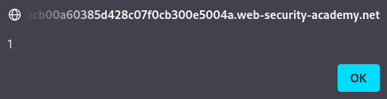

# DOM XSS in AngularJS expression with angle brackets and double quotes HTML-encoded

## Theory

<h3>DOM XSS в AngularJS</h3>

Если используется такая структура, как AngularJS, возможно выполнение JavaScript без угловых скобок или событий. Когда сайт использует атрибут ng-app для элемента HTML, он будет обработан AngularJS. В этом случае AngularJS будет выполнять JavaScript внутри двойных фигурных скобок, которые могут встречаться непосредственно в HTML или внутри атрибутов.

## Writeup

Главная страница:


Просмотрев код страницы, мы можем обнаружить атрибут ng-app (также известный как директива AngularJS).


В строке поиска мы будем использовать следующий эксплоит:
```
{{$on.constructor('alert(1)')()}}
```



Получаем ответ от сервера.

