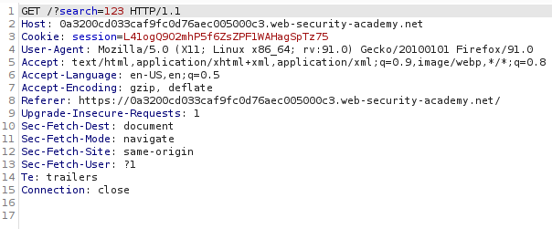
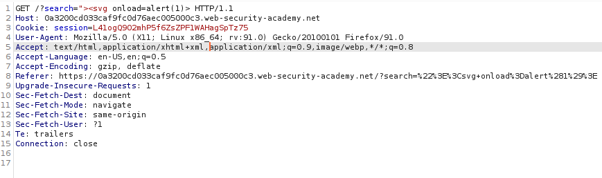

# DOM XSS in document.write sink using source location.search

## Theory

<h3>Использование DOM XSS с различными источниками и приемниками</h3>

В принципе, веб-сайт уязвим для межсайтовых сценариев на основе DOM, если существует исполняемый путь, по которому данные могут распространяться от источника к приемнику. На практике разные источники и приемники имеют разные свойства и поведение, которые могут повлиять на возможность использования и определить, какие методы необходимы. Кроме того, сценарии веб-сайта могут выполнять проверку или другую обработку данных, которые необходимо учитывать при попытке использовать уязвимость. Существует множество приемников, которые относятся к уязвимостям на основе DOM. 

Приемник document.write работает с элементами скрипта, поэтому вы можете использовать простую полезную нагрузку:
```
document.write('... <script>alert(document.domain)</script> ...');
```


## Writeup

Главная страница:


Отправим запрос в строке поиска и перехватим его.



Для решения будем использовать следующий эксплоит:

```
"><svg onload=alert(1)>
```



Получаем ответ от сервера.

