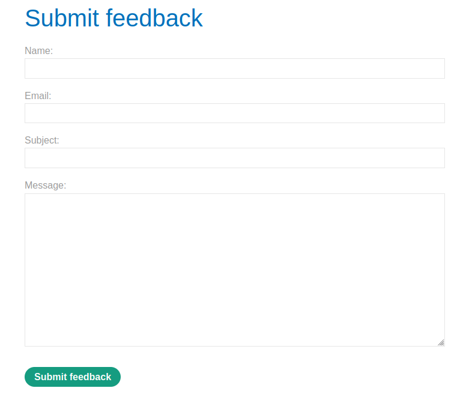
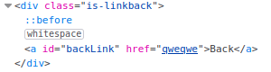

# DOM XSS in jQuery anchor href attribute sink using location.search source

## Theory

<h3>Источники и приемники в сторонних зависимостях</h3>

Современные веб-приложения обычно создаются с использованием ряда сторонних библиотек и сред, которые часто предоставляют дополнительные функции и возможности для разработчиков. Важно помнить, что некоторые из них также являются потенциальными источниками и приемниками DOM XSS.

<h3>DOM XSS в jQuery</h3>

Если используется библиотека JavaScript, такая как jQuery, обратите внимание на приемники, которые могут изменять элементы DOM на странице. Например, функция attr() в jQuery может изменять атрибуты элементов DOM. Если данные считываются из контролируемого пользователем источника, такого как URL-адрес, а затем передаются в функцию attr(), то можно манипулировать отправленным значением, чтобы вызвать XSS. Например, у нас есть код JavaScript, который изменяет атрибут href элемента привязки, используя данные из URL-адреса:
```
$(function() {
	$('#backLink').attr("href",(new URLSearchParams(window.location.search)).get('returnUrl'));
});
```

Вы можете воспользоваться этим, изменив URL-адрес так, чтобы источник location.search содержал вредоносный URL-адрес JavaScript. После того, как JavaScript страницы применит этот вредоносный URL-адрес к href обратной ссылки, щелчок по обратной ссылке запустит его:
```
?returnUrl=javascript:alert(document.domain)
```

## Writeup

Главная страница:


Перейдем на страницу "Submit feedback".



Данная страница сожержит в своем url следующее:
```
feedback?returnPath=/
```

Попробуем изменить значение returnPath на что-нибудь и найдем этот элемент в коде страницы.
```
feedback?returnPath=qweqwe
```



При помощи атрибута href мы можем доставить наш эксплоит, который будет выглядеть следующим образом:
```
feedback?returnPath=javascript:alert(document.cookie)
```

Получаем ответ от сервера.

