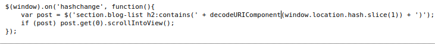
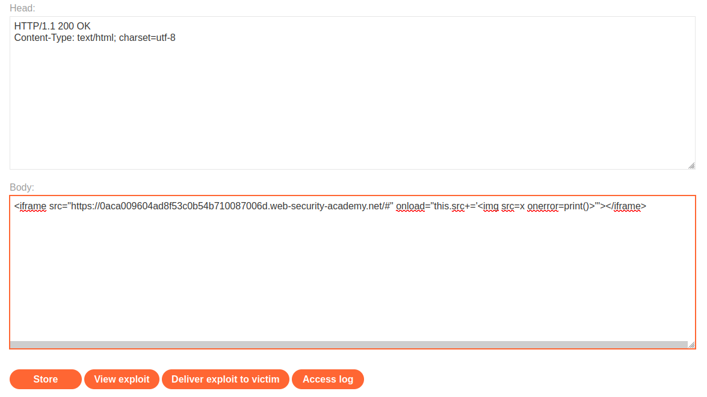
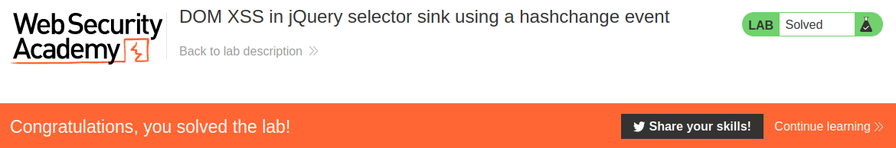

# DOM XSS in jQuery selector sink using a hashchange event

## Theory

<h3>Использование DOM XSS с различными источниками и приемниками</h3>

Еще один потенциальный приемник, на который стоит обратить внимание, — это селекторная функция jQuery $(), которую можно использовать для внедрения вредоносных объектов в DOM.

Раньше jQuery был чрезвычайно популярен, и классическая уязвимость DOM XSS была вызвана тем, что веб-сайты использовали этот селектор в сочетании с источником location.hash для анимации или автоматической прокрутки к определенному элементу на странице. Такое поведение часто реализовывалось с помощью уязвимого обработчика события hashchange, подобного следующему:
```
$(window).on('hashchange', function() {
	var element = $(location.hash);
	element[0].scrollIntoView();
});
```

Поскольку хэш контролируется пользователем, злоумышленник может использовать его для внедрения вектора XSS в приемник селектора $(). Более поздние версии jQuery исправили эту конкретную уязвимость, не позволяя вам внедрять HTML в селектор, когда ввод начинается с символа решетки (#). Тем не менее, вы все равно можете найти уязвимый код в дикой природе.

Чтобы на самом деле использовать эту классическую уязвимость, вам нужно найти способ инициировать событие изменения хеш-функции без взаимодействия с пользователем. Один из самых простых способов сделать это — доставить эксплойт через iframe:
```
<iframe src="https://vulnerable-website.com#" onload="this.src+=''">
```

В этом примере атрибут src указывает на уязвимую страницу с пустым хеш-значением. Когда iframe загружается, к хешу добавляется вектор XSS, вызывая срабатывание события hashchange.

## Writeup

Главная страница:


Просмотрев код страницы, мы можем найти свойство location.hash, которое можно использовать для эксплоита.



Перейдем в exploit server.


В поле body мы будем использовать следующий эксплоит:
```
<iframe src="https://0aca009604ad8f53c0b54b710087006d.web-security-academy.net/#" onload="this.src+=''"></iframe>
```

Сохраняем эксплоит и отправляем жертве.



Получаем ответ от сервера.

