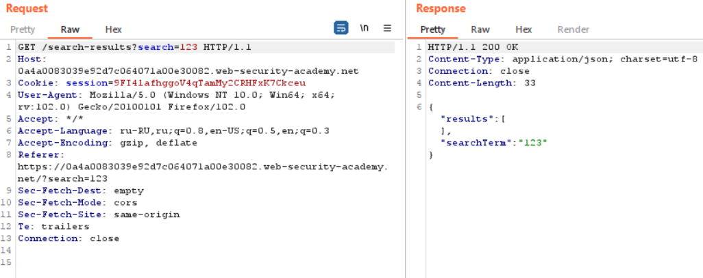
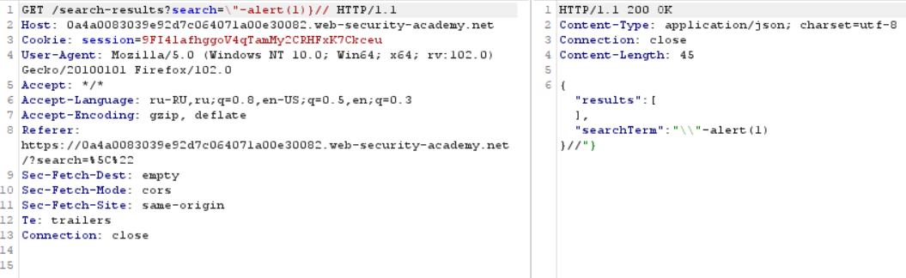

# Reflected DOM XSS

## Theory

<h3>DOM XSS в сочетании с отраженными и сохраненными данными</h3>

Некоторые уязвимости, основанные исключительно на DOM, находятся на одной странице. Если скрипт считывает некоторые данные из URL-адреса и записывает их в опасный приемник, то уязвимость полностью на стороне клиента.

Однако источники не ограничиваются данными, которые напрямую открываются браузерами — они также могут происходить с веб-сайта. Например, веб-сайты часто отражают параметры URL в HTML-ответе сервера. Обычно это связано с обычным XSS, но также может привести к так называемым отраженным DOM-уязвимостям.

При отраженной DOM-уязвимости сервер обрабатывает данные из запроса и повторяет эти данные в ответе. Отраженные данные могут быть помещены в строковый литерал JavaScript или элемент данных в DOM, например поле формы. Затем скрипт на странице обрабатывает отраженные данные небезопасным способом, в конечном итоге записывая их в опасный приемник.

## Writeup

Главная страница:


Отправим запрос в строке поиска и перехватим его.



Для решения будем использовать следующий эксплоит:

```
\"-alert(1)}//
```



Получаем ответ от сервера.

