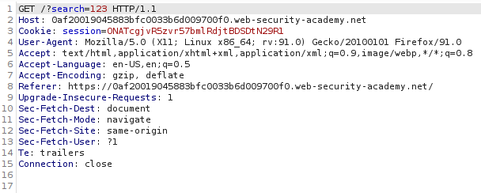
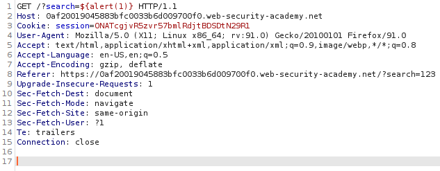
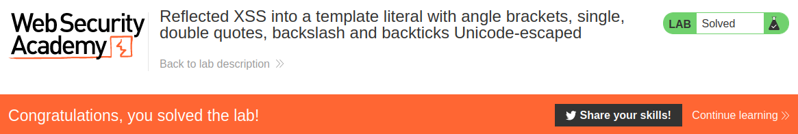

# Reflected XSS into a template literal with angle brackets, single, double quotes, backslash and backticks Unicode-escaped

## Theory

<h3>XSS в литералах шаблонов JavaScript</h3>

Литералы шаблонов JavaScript — это строковые литералы, допускающие встраивание выражений JavaScript. Встроенные выражения оцениваются и обычно объединяются с окружающим текстом. Литералы шаблонов заключаются в обратные кавычки вместо обычных кавычек, а встроенные выражения идентифицируются с использованием синтаксиса ${...}.

Например, следующий сценарий напечатает приветственное сообщение, включающее отображаемое имя пользователя:
```
document.getElementById('message').innerText = `Welcome, ${user.displayName}.`;
```

Когда контекст XSS находится в литерале шаблона JavaScript, нет необходимости завершать литерал. Вместо этого вам просто нужно использовать синтаксис ${...} для встраивания выражения JavaScript, которое будет выполняться при обработке литерала. Например, если контекст XSS выглядит следующим образом:
```
<script>
...
var input = `controllable data here`;
...
</script>
```

затем вы можете использовать следующую полезную нагрузку для выполнения JavaScript без завершения литерала шаблона:
```
${alert(document.domain)}
```

## Writeup

[1]: ./assets/1.png

Главная страница:

![][1]

Отправим запрос в строке поиска и перехватим его.



Для решения будем использовать следующий эксплоит:
```
${alert(1)}
```



Получаем ответ от сервера.


