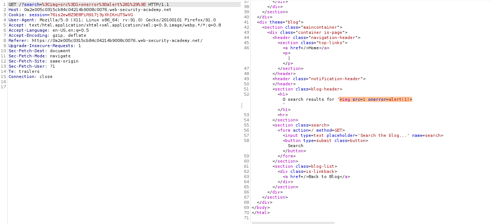
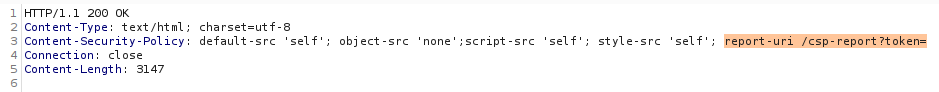
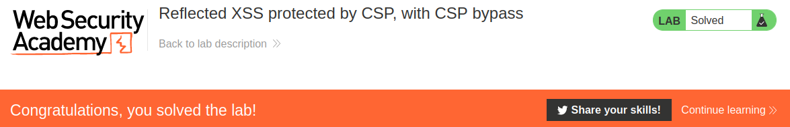

# Reflected XSS protected by CSP, with CSP bypass

## Theory

<h3>Противодействие атакам с висячей разметкой с помощью CSP</h3>

Следующая директива позволит загружать изображения только из того же источника, что и сама страница:
```
img-src 'self'
```

Следующая директива разрешает загрузку изображений только из определенного домена:
```
img-src https://images.normal-website.com
```

Обратите внимание, что эти политики предотвратят некоторые эксплойты с оборванной разметкой, потому что простой способ сбора данных без взаимодействия с пользователем — это использование тега img. Однако это не защитит от других эксплойтов, таких как внедрение тега привязки с оборванным атрибутом href.

<h3>Обход CSP с внедрением политик</h3>

Вы можете столкнуться с веб-сайтом, который отражает ввод в фактическую политику, скорее всего, в директиве report-uri. Если сайт отражает параметр, которым вы можете управлять, вы можете ввести точку с запятой, чтобы добавить свои собственные директивы CSP. Обычно эта директива report-uri является последней в списке. Это означает, что вам нужно будет перезаписать существующие директивы, чтобы использовать эту уязвимость и обойти политику.

Обычно невозможно перезаписать существующую директиву script-src. Однако недавно в Chrome появилась директива script-src-elem, которая позволяет управлять элементами скрипта, но не событиями. Важно отметить, что эта новая директива позволяет перезаписывать существующие директивы script-src.

## Writeup

Главная страница:


Отправим стандартный экплоит в поиске и перехватим ответ приложения. Код экплоита:
```

```





Мы можем обнаружить, что полезная нагрузка отображается, но CSP препятствует выполнению сценария. Мы также можем заметить, что ответ содержит заголовок Content-Security-Policy, а директива report-uri содержит параметр с именем token. Поскольку мы можем управлять параметром маркера, мы можем вводить в политику свои собственные директивы CSP. Для этого воспользуемся следующим экплоитом:
```
https://0a2e005c0315cb84c04214b9008c0076.web-security-academy.net/?search=%3Cscript%3Ealert%281%29%3C%2Fscript%3E&token=;script-src-elem%20%27unsafe-inline%27
```

Код экплоита без URL-кодировки:
```
https://0a2e005c0315cb84c04214b9008c0076.web-security-academy.net/?search=<script>alert(1)</script>&token=;script-src-elem 'unsafe-inline'
```

Получаем ответ от сервера.


