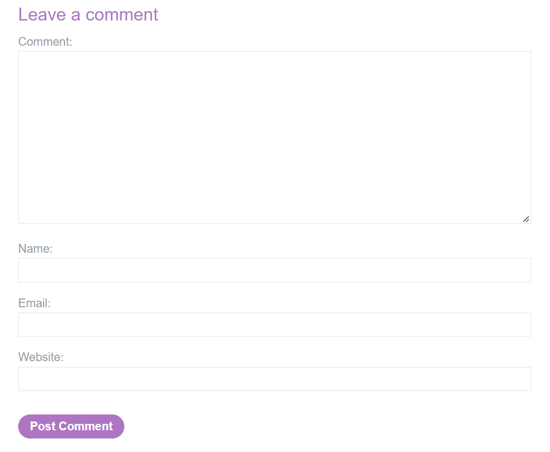
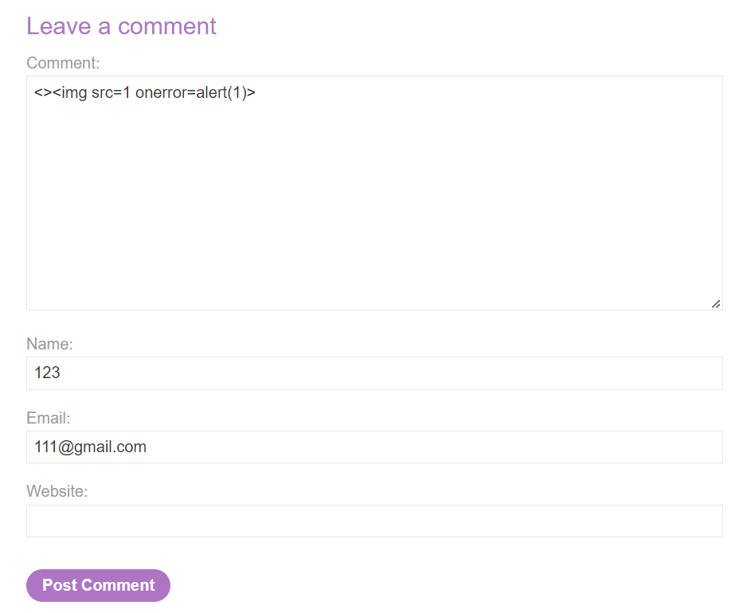

# Stored DOM XSS

## Theory

<h3>DOM XSS в сочетании с отраженными и сохраненными данными</h3>

Некоторые уязвимости, основанные исключительно на DOM, находятся на одной странице. Если скрипт считывает некоторые данные из URL-адреса и записывает их в опасный приемник, то уязвимость полностью на стороне клиента.

Однако источники не ограничиваются данными, которые напрямую открываются браузерами — они также могут происходить с веб-сайта. Например, веб-сайты часто отражают параметры URL в HTML-ответе сервера. Обычно это связано с обычным XSS, но также может привести к так называемым отраженным DOM-уязвимостям.

Веб-сайты могут хранить данные на сервере и отражать их в другом месте. В случае уязвимости с хранимым DOM сервер получает данные из одного запроса, сохраняет их, а затем включает данные в более поздний ответ. Сценарий в более позднем ответе содержит приемник, который затем обрабатывает данные небезопасным способом.
```
element.innerHTML = comment.author
```

## Writeup

Главная страница:


Перейдем к посту и спустимся в низ страницы. Мы можем заметить поле для комментария.



Запишем в поле комментария наш эксплоит и оставим комментарий. Код эксплоита:
```
<>
```



Получаем ответ от сервера.

